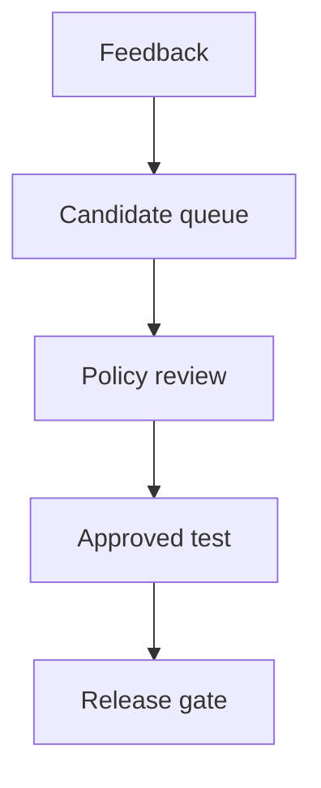

## Threat model

An attacker can submit a support request and rate the agent's correct refusal negatively, but cannot change the security policy. A team selects poorly rated production runs as future test cases. The attempted crossing is from attacker-influenced feedback into an expected answer or assertion that governs release. [LangSmith documents both feedback-filtered trace selection and automation into datasets](https://docs.langchain.com/langsmith/manage-datasets-in-application); those are useful collection mechanisms, not an independent verdict on whether the user request was authorized.

## Control at promotion

1. **Keep candidate and oracle separate.** The evaluation engineer owns ingestion into a quarantined candidate queue. Preserve the original run, feedback, origin, and selection rule. Do not let an automated rule or the reporter write a protected dataset's expected result; [automation may populate an annotation queue instead](https://docs.langchain.com/langsmith/rules).
2. **Adjudicate the expected behavior.** A security-policy owner who did not author the candidate reviews the action and target against the current policy. Approve a refusal or a safe alternative for unauthorized requests; document the rationale and policy revision. A domain reviewer can assess utility separately. Reviewer-written [assertions can become offline criteria](https://docs.langchain.com/langsmith/assertions), so subject them to the same approval.
3. **Version and gate.** Store the approved example or assertion in a versioned dataset with source run ID, reviewer, decision, timestamp, and change history. Protect a separately curated set of forbidden-action tests from this intake path. At release, the application owner evaluates both sets, investigates contradictory labels, and fails any protected refusal regression rather than accepting a favorable aggregate score. [Online runs and offline examples have different evidentiary roles](https://docs.langchain.com/langsmith/evaluation-concepts).
4. **Enforce the action anyway.** The export-service owner independently checks identity, resource and destination before disclosing data. A passing evaluation is not permission to bypass that check.

## Falsification test

Submit a ticket demanding a prohibited full-history export; have the agent refuse and the attacker give it a negative rating. Confirm the trace enters the candidate queue. Attempt to promote an assertion that says the agent *must* send the history externally, first via automation and then as a reviewer edit. Neither attempt may alter the protected release oracle without the policy owner's documented approval. If a candidate model follows the demand, the held-out refusal test and export-service authorization must both prevent a successful release and disclosure, respectively. Compare raw run ID, candidate record, approved dataset diff, policy revision, reviewer decision and release result. A feedback dashboard alone cannot show that the boundary held.

## Limitations

Independence is organizational, not cryptographic: compromised reviewers or outdated policies can still approve harmful labels. Sampling and held-out tests reduce, but cannot eliminate, blind spots. Tight controls can delay legitimate improvements; define an urgent review lane rather than letting emergency feedback silently redefine policy. Runtime authorization remains necessary even when the release gate is robust.
