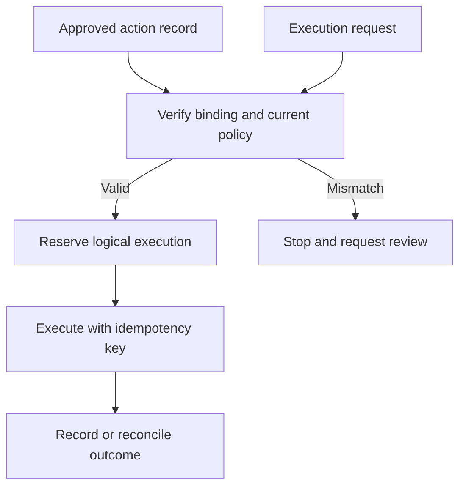

## Context and Problem

An agent pauses for approval, then resumes with mutable arguments or resources. A saved confirmation can outlive the request it was meant to authorise. Queues and delegated work make that gap harder to observe.

OWASP describes the underlying transaction controls: protect the reviewed data and verify authorization at execution. This pattern proposes an agent-specific implementation using a protected action record.

## Solution

The platform team owns the action store and dispatcher. The application owner defines which actions require review and which fields are material to that decision.

1. **Create an immutable proposal** — Store the acting identity, represented user, tool and operation, resolved destination, payload digest and resource versions. Include the tenant and task ID. Resolve mutable references to a snapshot, or require a version precondition at the target.
2. **Review that proposal** — Generate the approval screen from the stored record. Show the recipients, scope and side effects in readable form. Escape untrusted text so document content cannot imitate the approval interface.
3. **Record the decision** — Authenticate the reviewer and check their authority to approve. Store the proposal ID, digest, decision, reviewer and expiry in protected state. A message in chat is not an approval record.
4. **Check at dispatch** — Re-evaluate current permissions and compare the executable request with the approved record. Any material change or expired approval stops execution and returns the proposal for review.
5. **Consume and reconcile** — Atomically reserve the approved action for one logical execution. Use a stable idempotency key where the downstream service supports it. Record the result; reconcile an unknown outcome before retrying.

## Problems and considerations

- A digest detects changes only when the record is protected and the same canonical representation is used for review and dispatch. A caller-supplied hash provides no authority.
- A mutable file or URL can change after the comparison. Execute a stored snapshot or enforce a version precondition at the service performing the action.
- An internal transaction cannot guarantee exactly-once behaviour at an external API. If the target lacks idempotency support, ambiguous outcomes may require manual reconciliation.
- Approval can become stale even when the payload is unchanged. Set short, risk-based lifetimes and recheck entitlement after a long pause.
- Protect stored payloads and limit retention. Audit metadata should reference restricted content without copying secrets into general logs.

## Validation

Approve a test action, then change its recipient, payload or resource version. Each change must stop dispatch. Repeat with an expired approval, revoked reviewer authority, a concurrent replay and a timeout after the target has accepted the request. Confirm that the last case is reconciled without blindly repeating the side effect.

## When to use this pattern

Use this for agent actions that send data externally, alter production resources, grant access or spend money. Apply it to the consequential action itself; reviewing every harmless intermediate step creates fatigue without preserving transaction integrity.
