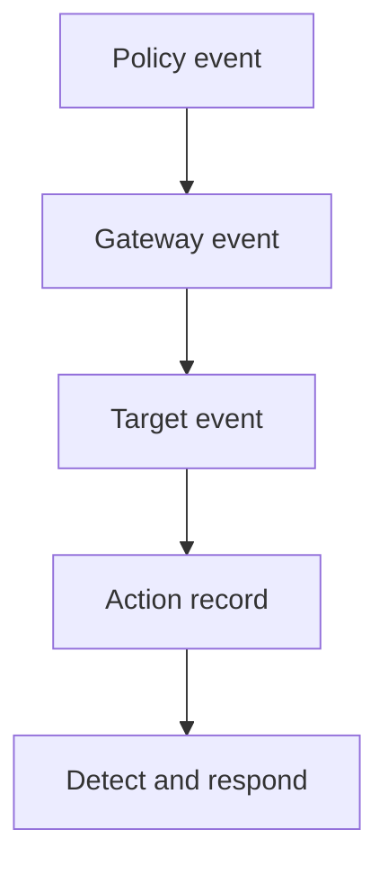

## Context and Problem

An agent action crosses an orchestrator, policy service, tool gateway and target system. Each component records a locally meaningful result, but no single event proves the whole action. Transport success is often labelled as execution success, identifiers arrive from less-trusted callers, and missing target evidence is silently treated as completion.

## Solution

The platform team owns the correlation contract and trusted operation identifier. Control owners define the policy evidence. Target owners expose authoritative outcome events. Detection engineering owns joins, time windows and missing-stage alerts.

1. **Create a trusted operation** — At the first trusted ingress, generate a unique operation ID and bind it to the authenticated workload, represented user where applicable, tenant and originating task. Preserve an external trace ID only as an untrusted correlation field. Never use either identifier as authority.
2. **Record the decision** — Before consequential dispatch, emit the requested action, normalised target, policy version, decision, reason and evidence source. Store this through a path the agent cannot rewrite. A record says what the decision point asserted; protect its integrity and identity accordingly.
3. **Record the handoff** — The gateway emits whether it denied, attempted or received acknowledgement for the request. It carries the operation ID to supported downstream systems and records any local job or transaction identifier returned. Do not translate an HTTP success or queue acknowledgement into a completed side effect.
4. **Observe the target** — Obtain the target's authoritative outcome or state-change audit event. Map it back through a protected transaction or job identifier. Record completed, failed and unknown explicitly; use bounded reconciliation for asynchronous or unreachable targets.
5. **Join and detect** — Build an append-only action record that retains event source, event time, ingest time and confidence. Detect missing, duplicated and impossible transitions as well as malicious values. Route unresolved high-impact actions to response rather than closing them as success.

The action record is evidence assembled from named sources. It is not a new source of truth, and its operation ID is a join key rather than an authorisation token.

## Problems and considerations

- Targets may not support caller-provided identifiers. Maintain a protected mapping to their transaction, job or audit IDs and test collisions and reuse.
- Clock skew and asynchronous work make event order uncertain. Retain event and ingest times, use explicit state transitions and define reconciliation windows by action type.
- A compromised gateway can falsify both dispatch and decision evidence if it owns both. Separate control and recording paths for high-impact actions, then corroborate with target state.
- High-cardinality identifiers and target events can increase telemetry cost. Sample performance traces if needed, but do not sample away the audit events required to explain consequential actions.
- Correlation can expose prompts, resource names and user identity. Minimise content, pseudonymise where possible and restrict the joined record independently from general observability data.

## Validation

In a disposable environment, run one denied action, one completed action and one asynchronous action. Confirm that each stage has the same trusted operation ID, correct authenticated identities and distinct decision, dispatch and target outcomes.

Then drop, duplicate, delay and reorder one event from each source. Attempt a target change that bypasses the normal gateway and submit a forged external trace ID. Confirm that the pipeline reports missing or impossible sequences, does not merge tenants, and leaves ambiguous outcomes unresolved. Measure detection and reconciliation latency against the response objective.

## When to use this pattern

Use this when agents can change external state through tools, queues or A2A services and responders need to reconstruct, detect and reconcile consequential actions across trust boundaries.
