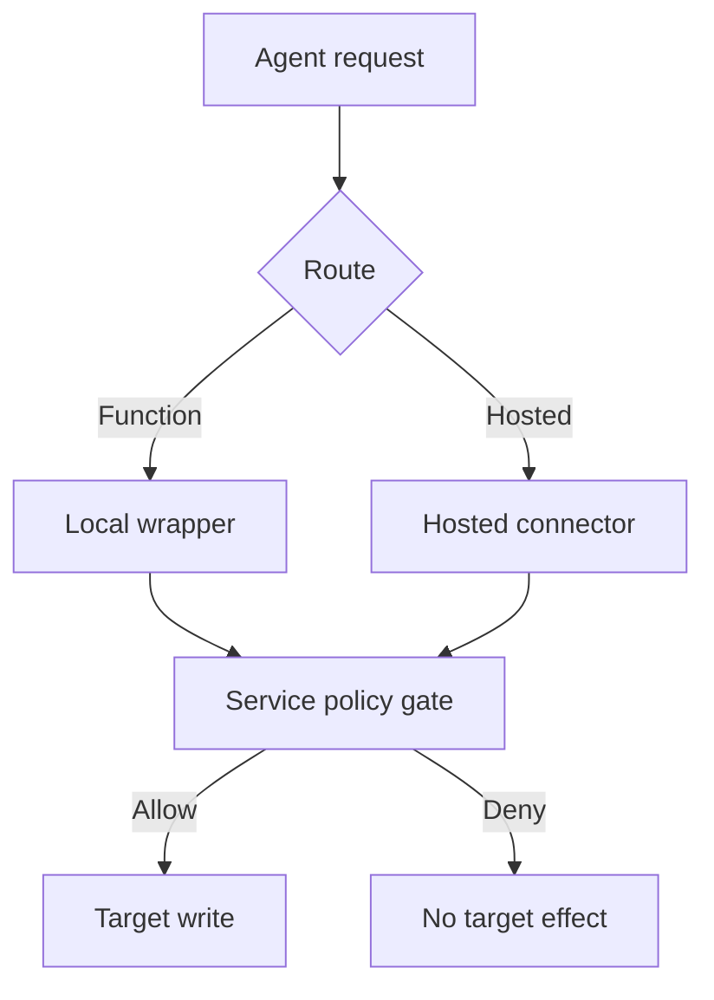

## Boundary and ownership

The model and its inputs can influence which route requests an action. They cannot be the authority that decides whether that action may change a protected service. The [OpenAI Agents SDK tool-guardrail contract](https://openai.github.io/openai-agents-python/guardrails/#tool-guardrails) covers guarded `FunctionTool` calls (including configured local MCP tools), not hosted or built-in tools, handoff calls or `Agent.as_tool()` directly. This is a route-coverage design pattern, not a claim of a vendor vulnerability. The service owner owns authorization and outcome evidence; the orchestration owner owns route inventory; security owns policy and negative tests.

## Control construction

1. **Group by effect.** List every route that can send, export, write or administer the same target: guarded function, hosted integration, built-in execution, handoff to another agent, background worker and direct API. Record its credential, recipient service and whether it can be forced through the gate. Revisit the inventory on tool and identity changes.
2. **Move the decisive check to the service.** At the target API or unavoidable gateway, authenticate the calling workload and represented user where applicable. Evaluate tenant, action, recipient, data class and resource against centrally owned policy immediately before the side effect. Bind a decision to the exact request. Missing policy, missing identity and unknown tools deny high-impact operations. A model-generated `approved` field does not count. [OWASP calls for authorization in the execution component](https://cheatsheetseries.owasp.org/cheatsheets/AI_Agent_Security_Cheat_Sheet.html#tool-authorization-middleware).
3. **Remove bypass authority.** Use service-scoped credentials that cannot invoke an alternative target endpoint. If a hosted integration cannot use the gate, restrict its write permission with provider-native controls or turn it off; do not count it as covered merely because the equivalent local function is guarded.
4. **Prove an effect or a denial.** Mint a service-owned operation ID and retain route, actor, target, policy version, decision and reason, without full content. Join permitted operations to the target's accepted/committed outcome. Monitor target changes without decisions, allows with no resolved outcome and calls from newly discovered routes. Keep target audit and gate receipts under separate permissions.

A local wrapper can give fast feedback and inspect function-specific arguments. It cannot authorize other pipelines by implication. A handoff also requires recipient-specific data controls; [handoff arguments and input filters govern different surfaces](https://openai.github.io/openai-agents-python/handoffs/). This gate governs the eventual action, not the privacy of context passed to a specialist.

## Falsification test

In a test tenant, send a synthetic canary report to a denied external destination through each inventoried route, including a direct API call with the agent credential. Inspect the **target state** as well as the gate receipt: there must be no send, and every reachable attempt must have a denial or a clearly disabled route. Remove the local function guardrail and repeat; the target must still deny. Break policy retrieval and repeat for a high-impact action; it must not send. Then approve a harmless internal recipient and check that the target outcome joins to one exact allow. An unreceipted write or an unresolved outcome fails the assurance claim.

## Limits

No gateway proves universal coverage if another credential can write directly to the target. Target audit can be delayed or compromised; reconcile important effects against target state and independent delivery records. Hosted tools may enforce controls the organization cannot observe or customize: document that scope as a separate assurance claim, constrain credentials and do not manufacture a service-side verdict. Availability suffers when high-impact writes fail closed during policy outages; exercise recovery separately.
