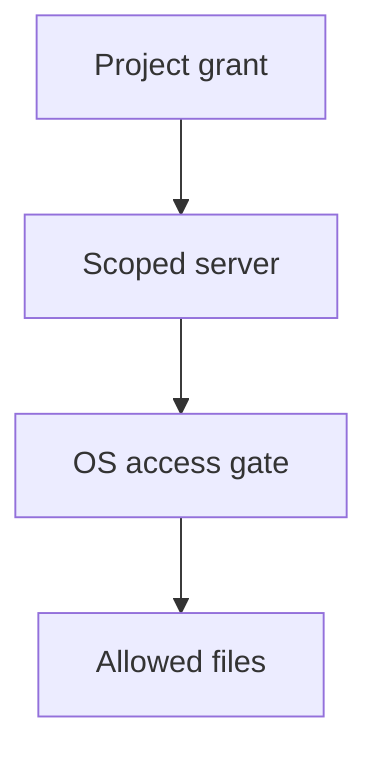

## Problem

An MCP root is a suggested workspace, not a process sandbox. The July 2026 specification makes that distinction explicit and deprecates roots in favor of paths passed via tool parameters, resource URIs or server configuration.[1][3] Those replacements identify a target but do not themselves remove the server's ambient filesystem authority. MCP's client guide points to OS permissions and sandboxing for enforcement.[2]

## Pattern

1. **Define the grant outside the server.** The host records the user-approved workspace and allowed operations. Give the server a dedicated identity or sandbox whose readable and writable paths match that grant; do not run it with the user's unrestricted home-directory access.
2. **Constrain the open, not just the string.** Within the allowed area, validate requested operations and resolve paths safely at file-open time. Account for absolute paths, traversal, symlinks and races. Never rely on a prefix comparison as the sole gate.
3. **Separate discovery from permission.** A folder in a picker or a path parameter says what task the user intends. The OS boundary decides what the server can touch, including when it ignores the tool API and opens files directly.
4. **Test from the attacker's position.** Run an outside-project decoy read in the server process, including a direct file open that bypasses its ordinary tool handler. The decoy must remain unreadable. Test a legitimate in-project read so the policy is usable.
5. **Reconcile change.** When the workspace grant changes, revoke the old server instance or update its isolation before more calls. Log denials without exposing file contents.

## Limitations

A process sandbox can still read sensitive material **inside** the permitted project; minimize the granted directory and operations. A malicious file within it can inject instructions into an agent's tool result. Network access, write privileges, and downstream tool invocations need their own boundaries. When migrating away from roots, explicit path arguments improve clarity but do not replace these controls.[1][2]

## When to use

Use for local MCP servers or agent tools that inspect or edit user workspaces, particularly when the UI implies that selecting a folder limits access. If a trusted remote service hosts the filesystem, enforce the same grant in its storage authorization layer instead of assuming a local OS sandbox exists.
