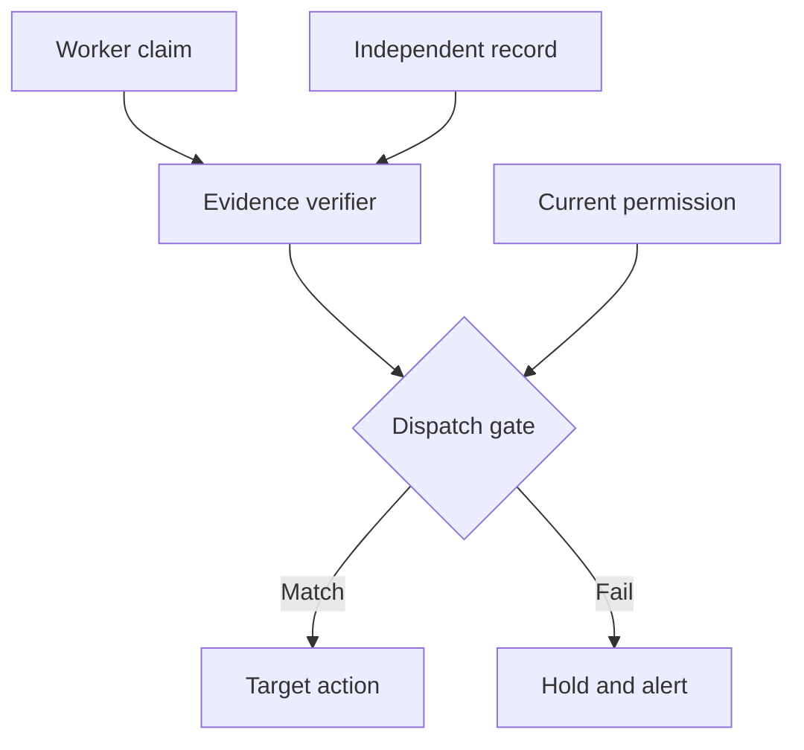

## Threat model

A legitimate callback worker, or a compromised worker identity, completes an asynchronous task with an inaccurate conclusion or altered destination. An agent then performs a privileged action based on that result. [Step Functions callback tasks](https://docs.aws.amazon.com/step-functions/latest/dg/connect-to-resource.html) and [Temporal asynchronous activity completion](https://docs.temporal.io/activity-execution) provide mechanisms for delivering results; they are not substitutes for an application's independent review of a business claim. The scenario does not allege a platform vulnerability.

## Control location and owner

1. **Register the expected job.** The application owner persists tenant, subject, job ID, expected worker identity, allowed result fields, bound destination or destination policy, expiry and authorization revision before giving the worker a completion handle. Do not expose handles to the agent or untrusted content.
2. **Constrain ingestion.** A callback adapter authenticates the caller, checks its assignment to this still-open job, validates schema and immutable fields, and records a single outcome atomically. Reject conflicts rather than choosing the last result. [SendTaskSuccess](https://docs.aws.amazon.com/step-functions/latest/apireference/API_SendTaskSuccess.html) takes a token and output, but its acceptance is not evidence that a claimed review occurred.
3. **Verify the claim.** The decision owner fetches the review or status from a separately controlled source by immutable ID and version. Match tenant, subject, outcome and destination to the registered job. A worker-supplied URL or prose summary alone cannot serve as independent evidence. Where no independent source exists, hold high-impact work for a human check instead of silently promoting the callback to authority.
4. **Gate dispatch.** The tool gateway rechecks current entitlements and the approved destination immediately before the effect; it records job ID, evidence version, policy verdict and target receipt in a protected action ledger. Do not log completion tokens or sensitive dossier contents. An agent sees only a constrained verdict, not raw instructions in the callback body.

## Falsification test

Create a test job with a real approval record and a harmless target that logs delivery. Send a syntactically valid completion from an assigned worker with the wrong subject, an altered recipient, an invented approval ID, and an expired permission. Repeat while the source record is unavailable, after callback replay, and with two concurrent contradictory completions. Demand zero target deliveries for every mismatch or unverifiable state; the accepted case produces one receipt tied to the registered job and evidence version. Confirm from the target log, not just the workflow status. Include a test where callback acceptance succeeds but the application gate denies dispatch.

## Limitations

Independent evidence can share a compromised administrator or bad source data with the worker; isolate its ownership and audit changes. If the provider cannot scope callback credentials to a single job, an application adapter must enforce that assignment and protect handles. A callback result cannot undo a side effect already launched by the worker; use separate target-side fencing for that problem. [Temporal notes](https://docs.temporal.io/activity-execution) that an asynchronously held task token can become invalid after retry; reconcile job state rather than assuming a stale token is a fresh approval.
