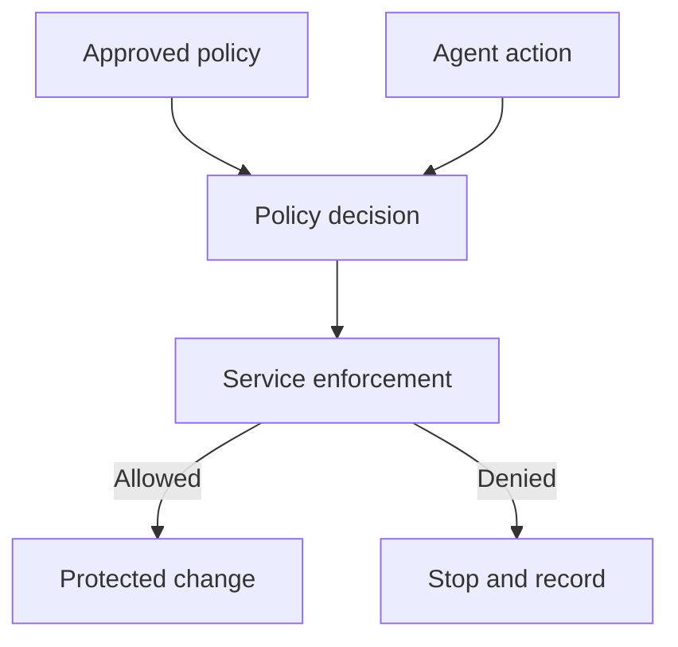

## Context and Problem

An AI coding agent reads policy from its prompt, workstation or repository. The same agent can change that policy, select an ungoverned client, call a service directly or use credentials that bypass the intended check. The organisation cannot demonstrate that the policy governed the resulting action.

This pattern applies policy decoupling to AI-assisted software delivery. OPA documents the general separation of policy decision-making from enforcement. GitHub rulesets and SLSA provenance supply examples of service-side control and verifiable build history. The cross-service architecture below is a proposed implementation.

## Solution

The security or platform policy owner controls the approved policy bundle and exceptions. Each service owner operates an enforcement point. The application owner defines permitted repositories, tools, data classes and deployment targets.

1. **Publish authoritative policy** — Store reviewed, versioned policy in a protected control plane. Sign the bundle or deliver it through an authenticated channel. Separate read access for enforcement points from permission to change policy. Keep exceptions scoped, approved, attributable and time limited.
2. **Treat local configuration as guidance** — Distribute equivalent instructions to agent clients so they can avoid invalid requests and explain decisions. Assume the local copy can be changed. Never accept its contents or a caller-supplied policy version as proof that an action is allowed.
3. **Enforce at the service boundary** — Require checks at source-control writes, protected merges, trusted builds, credential issuance and deployments. Evaluate the authenticated actor, represented human where relevant, repository, revision, requested action, destination and current policy version. Deny when required context or policy state is unavailable.
4. **Bind the decision to the action** — Return a short-lived decision identifier or use a transaction local to the enforcement point. Bind an allow to the exact request and consume it only through the protected path. Re-evaluate material changes rather than copying an old allow to a new action.
5. **Attest the result** — Record the source revision, workflow identity, policy decision, build inputs and produced artifact. Permit production release only from the approved build path. Send policy bypasses, denied direct calls and ungoverned identities to security monitoring.

The service enforcement point owns the final decision-to-action binding. The agent cannot replace that decision with text from its repository or conversation.

## Problems and considerations

- No single policy engine automatically covers every route. Inventory direct APIs, service accounts, administrative bypasses, local builds and emergency paths, then place controls where each consequential action occurs.
- Cached policy and entitlement data create a revocation delay. Define its maximum age and fail closed for actions whose risk cannot tolerate stale decisions.
- Administrators may retain emergency bypass authority. Require a separate identity, strong authentication, reason capture, alerting and retrospective review; do not give the everyday agent token the same capability.
- A signed local file proves origin and integrity, but it does not force the client to use it. Enforcement still belongs at a boundary the requester cannot avoid.
- Central enforcement can disrupt delivery if policy services fail. Use tested local replicas or service-native rules where suitable, while preserving controlled versions and deny behaviour for high-impact actions.

## Validation

Give a test agent a repository policy that prohibits direct pushes and production deployment. Alter or delete the local file, use a second client and call the service APIs directly. Confirm that protected branches, credential issuance and deployment remain blocked and that monitoring receives an attributable event.

Then approve one exact revision through the trusted workflow. Change the source after approval, replay the decision against another repository and submit an artifact built outside the approved job. Each attempt must fail. Verify that the successful release can be traced to its source, workflow identity, policy version and artifact digest.

## When to use this pattern

Use this wherever AI coding tools, plugins or agents can change source, request credentials, merge code, trigger builds or deploy workloads. It is especially useful when teams distribute policy through repository files or endpoint configuration and need evidence that the rule is enforced centrally.
