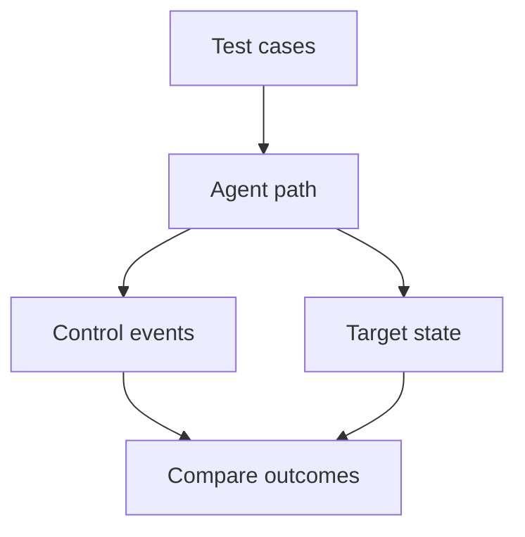

## Context and Problem

A guardrail evaluation can score the model's answer while missing a tool side effect, or reward broad refusal while legitimate tasks fail. Security operations may receive a detector event without enough context to contain the associated workload.

This is a proposed assurance pattern. OWASP supplies the underlying prompt-injection and logging guidance; the test design and acceptance measures below are implementation recommendations, not a vendor certification.

## Solution

The application owner defines acceptable actions. The security engineering team maintains the test cases. The SOC owns response acceptance; the platform team owns the execution and evidence paths.

1. **Define observable outcomes** — For each risk, specify the forbidden effect and the permitted task. Use synthetic data, disposable resources and destinations controlled by the test team. Check the destination or resource state independently of the model's narrative.
2. **Exercise the real route** — Use production-equivalent identity, guardrail, tool and queue configurations in an isolated test environment. Include malicious documents and tool responses, delayed execution, detector timeouts and routes that resume without a fresh model turn. Label any missing integration as a coverage gap.
3. **Collect linked evidence** — Issue a server-controlled test ID and join it to the workload identity, tool request, detector version and result, policy version and decision, execution timestamp and target outcome. Record collector loss and unknown outcomes. Keep essential security events outside optional performance-trace sampling.
4. **Test the response** — Route selected events into a labelled SOC exercise queue. Confirm the analyst or approved automation can stop further dispatch and restrict the affected identity. Verify the effect at the target; an accepted response command is not sufficient evidence.
5. **Gate release** — Run a versioned case set plus held-out variations. Repeat stochastic cases and publish counts. The risk owner sets acceptance thresholds before testing; release only after failures and coverage gaps have an explicit disposition.

The target is a controlled test resource. Its state supplies evidence about side effects; the control events explain the decisions taken along the way.

## Problems and considerations

- A finite test set cannot establish immunity to new attacks. Report the tested configuration, dates, case families and exclusions alongside the results.
- A detector miss and a successful attack are different failures. Preserve both fields so improvements in one control do not conceal weakness in another.
- Logs are evidence from their emitter, not automatically trustworthy ground truth. Protect collection and corroborate consequential actions with the target system.
- Full prompts and tool outputs may contain secrets or personal data. Store synthetic exercise content separately and use restricted evidence references for production incidents.
- Treat missing target evidence as unknown. Do not count a timeout or dropped event as a prevented attack.

## Validation

For each case, record whether the prohibited effect occurred and whether the legitimate objective completed. Calculate attack success over attack attempts and legitimate-task failure over benign attempts separately. Also report the fraction of attempts with complete evidence, alert delivery delay, and time to verified containment.

Inject a collector outage, a guardrail timeout and a response command that is acknowledged but ineffective. Confirm each produces the intended failure classification. Any numeric release threshold belongs to the application's risk owner; this pattern does not supply a universal safe percentage.

## When to use this pattern

Use this when making a security claim about an AI application that can access protected data or perform actions, and when deciding whether a guardrail or detection integration is ready for production.
