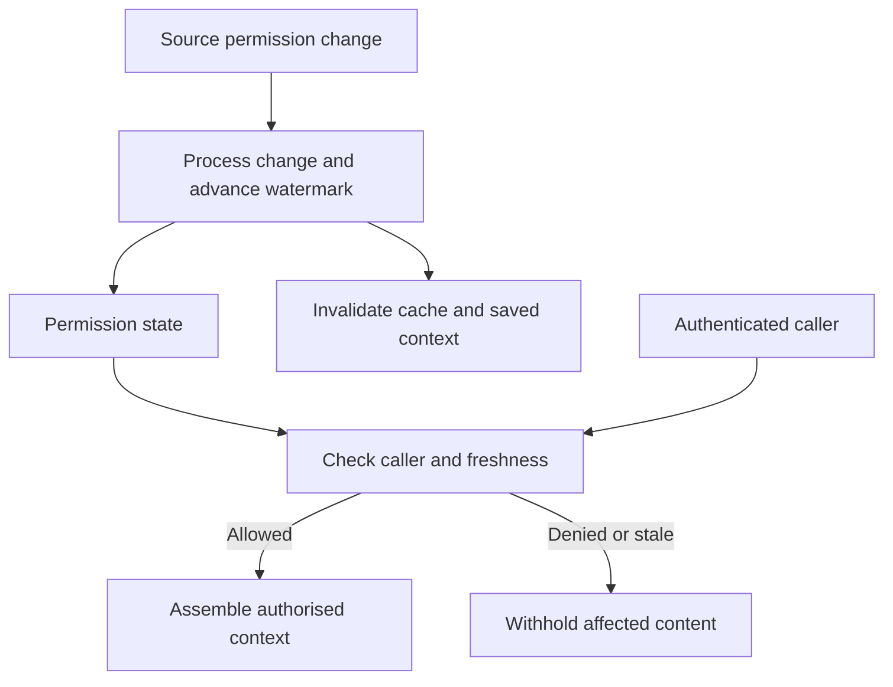

## Context and Problem

An AI retrieval service keeps derived content in chunks, indexes and answer caches. Access removed from the source can remain effective in those copies until the system processes the change.

Azure AI Search documents query checks against synchronized permission metadata. This pattern adds an explicit operational contract around that behaviour: the organisation decides how much revocation delay it accepts and what happens when the system cannot meet it.

## Solution

The data owner sets the permitted revocation delay. The retrieval platform owns enforcement, freshness monitoring and cache invalidation.

1. **Preserve provenance** — Give every chunk a stable source document ID, tenant, content version and reference to its permission state. Do not drop those fields during enrichment, splitting or reindexing. Quarantine records with missing authorization metadata.
2. **Establish the caller** — Resolve the user and relevant group membership from a trusted identity service. Keep ingestion credentials separate from query authorization. Never accept a user ID supplied by the model as proof of entitlement.
3. **Define freshness** — Set a maximum permitted age for permission and membership state per data class. Track successful synchronization through a source watermark or equivalent acknowledgement of processed changes. A job start time alone does not demonstrate freshness.
4. **Gate context assembly** — Check entitlement and freshness before releasing a chunk to the model. For sources requiring faster revocation than synchronization can deliver, perform a live source authorization check or exclude them from the indexed route. A failed check must not fall back to an unrestricted query.
5. **Handle derived copies** — Track document dependencies for cached answers and saved context. On revocation or deletion, invalidate affected entries and require reauthorization before reuse. Retire or rebuild server-managed conversation context containing material that can no longer be used.
6. **Measure the boundary** — Log the decision, document IDs and permission version without logging document bodies. Alert when the revocation delay exceeds the agreed limit and withhold the affected collection until the boundary is restored.

## Problems and considerations

- Group membership and document ACLs may update through different paths. The effective revocation delay includes both, as well as cache lifetime and queued requests.
- Native controls vary by connector and API version. Test the exact source, inherited permissions and group types used in the deployment.
- A broad ingestion identity can be necessary to build the index. Restrict its credentials to ingestion and prevent clients from bypassing the retrieval service with equivalent read access.
- Revocation cannot retract information already delivered to a person. The objective is to prevent subsequent retrieval and reuse by the system; retained audit records need their own access and retention policy.
- Live authorization adds latency and source dependency. During an outage, return a clear access-verification failure instead of treating an empty result as proof that no document exists.

## Validation

Use two users with different entitlements and a document containing a unique test phrase. Warm search, answer caches and a conversation for the permitted user. Remove access, then repeat through fresh and resumed requests. Measure when every route stops using the phrase. Repeat with inherited access, group removal, deletion and a stalled permission-sync job. Verify that the other user never receives the phrase.

## When to use this pattern

Use this for retrieval over confidential or tenant-separated content, especially where source permissions change frequently. For a deliberately public corpus, permission freshness may be unnecessary; provenance and deletion handling still matter.
