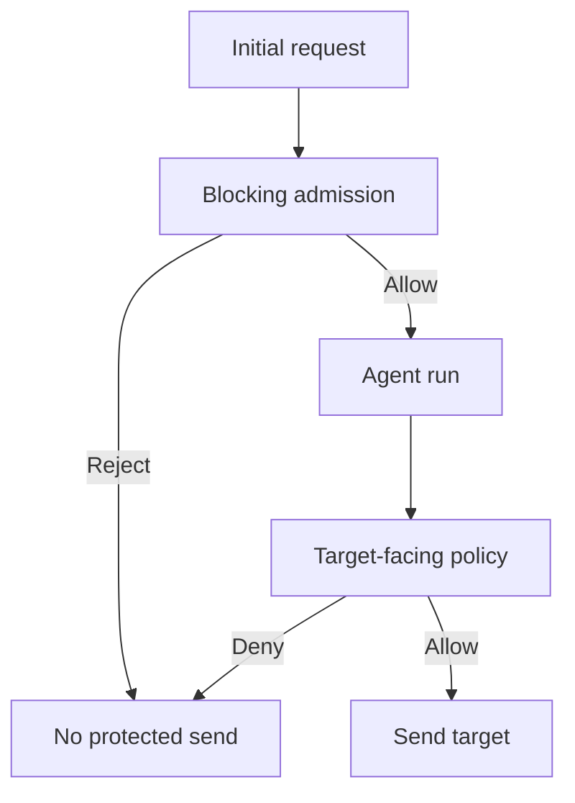

## Threat and ownership

A lower-trust case note or tool result can steer a model toward an outbound send. The attacker controls that content, not the authenticated actor or policy. The application owner controls admission and dispatch; the target-service owner enforces send authorization; the security team owns a test that proves absence of delivery. This is a proposed architecture, not a claim that a named product was compromised. [Parallel input guardrails can trip after an agent has already executed tools](https://openai.github.io/openai-agents-python/guardrails/), so cancellation is not a compensating control for an external side effect.

## Construction

1. **Separate admission from dispatch.** Configure a blocking input check for runs where a rejected input must have no effects. Keep ordinary low-risk analysis parallel only when the availability and latency trade-off is deliberate. This check only sees the initial input; do not infer safety for later retrieved content.
2. **Gate the effect where it can be stopped.** Route every send through an application-controlled adapter or target-side endpoint. Authenticate the actor and decide against recipient, data class, action, purpose and current permission immediately before dispatch. Deny on policy timeout for high-risk sends. The target rejects direct calls carrying only agent credentials or a model-generated claim of approval.
3. **Map actual coverage.** Inventory function tools, hosted tools, built-in executors, handoffs, retries and resumed runs. The [SDK tool-guardrail pipeline excludes hosted and built-in execution tools and handoff calls](https://openai.github.io/openai-agents-python/guardrails/#tool-guardrails); an annotation on a function tool is not universal interception. For other runtimes, verify the entry points of middleware such as [LangChain's wrapping tool hook](https://docs.langchain.com/oss/python/langchain/middleware/custom). Restrict network and credentials on local executors because [SDK approval is not a sandbox](https://openai.github.io/openai-agents-python/tools/).
4. **Reconcile decision and effect.** Emit a server-owned operation ID and a narrow dispatch verdict; the target records acceptance or rejection against that ID. Compare target state with decisions, alert on sends without a matching allow and do not record message contents or secrets in routine receipts. This evidence shows what the gate and target did, not whether a model intended harm.

## Falsification test

Delay the admission verdict and inject a harmless canary into a case note. A rejected run must create no target-side send. In another run, allow admission and put the canary into a later tool result: the dispatch policy must reject an unauthorized recipient. Repeat via a delegated agent, resumed call, every configured tool type and a direct request to the target with agent credentials. Force policy-store failure and require a closed send path. Query a test inbox or target state as well as logs; also prove that a normal authorized send succeeds. Any unauthorized delivery disproves coverage even if the run ends in a tripwire exception.

## Limits

A target gate can protect only actions routed through it. Privileged local shell, unmanaged network access or credentials may create alternate sends; contain those separately. A blocking guardrail can be wrong, and target audit can fail. Preserve independent target-state checks and update the route inventory when tools change.
