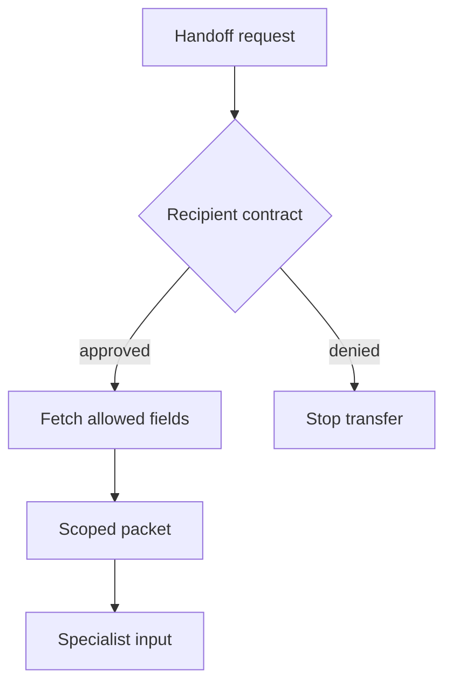

## Threat model

The coordinator has read sensitive material for one purpose, then routes work to a specialist that needs only a subset. A user can influence routing or place text in the history. The receiving agent may have different tools, operators or model-provider data handling. [OpenAI Agents SDK handoffs forward previous conversation history by default](https://openai.github.io/openai-agents-python/handoffs/); a [LangChain supervisor can choose to supply full history](https://docs.langchain.com/oss/python/langchain/multi-agent/subagents) rather than the default isolated task. The threat is oversharing at the coordinator-to-specialist data boundary, not a claim of a known vendor breach.

## Control and owner

1. **Declare recipients.** The orchestration owner maintains an allowlist of specialist identities, purposes, permitted data classes and provider/retention boundaries. The case owner approves which roles may see which case fields. Keep this contract versioned.
2. **Build a packet outside model prose.** For each route, application code uses authenticated tenant and case IDs to fetch the permitted fields. Include a short task statement, scoped opaque references, allowed field names and a server-generated packet ID. Reject missing authorization, mismatched tenant, unexpected fields or an unavailable policy store. A typed handoff argument is only a schema for model-generated metadata; [it does not replace the next agent's main input](https://openai.github.io/openai-agents-python/handoffs/).
3. **Enforce the transfer.** Use a handoff input filter covering history, earlier items, new items and ordinary messages that quote tool output. For SDK server-managed history, start a separate run with explicitly selected packet input rather than forwarding the original conversation/response ID. A subagent-as-tool wrapper should likewise send only the packet, not parent history. Do not rely on a model-generated summary as redaction.
4. **Prove what crossed.** At the recipient model-request boundary, record packet ID, destination, field classifications, contract version and a protected digest of the actual sent input. Do not put customer content or reusable credentials in routine audit logs. Reconcile this with the handoff decision and any specialist tool authorization. [Run results expose filtered input and separate rich handoff items](https://openai.github.io/openai-agents-python/results/); make sure diagnostics do not themselves become a wider disclosure channel.

## Falsification test

Insert distinct synthetic canaries into a prior tool result, its quoted ordinary message and a nested history summary. Route to the specialist and capture the **actual** model request: no canary may cross, even if a `remove_all_tools` helper removed structured tool items. Attempt a cross-tenant case reference, an unapproved field and a policy-store outage: all must stop before recipient invocation. Test a server-managed conversation by ensuring no original conversation ID or previous-response ID accompanies the separate run. Then verify a legitimate minimal packet still allows the specialist's read-only task. Compare boundary capture, packet manifest and decision record; a clean final answer alone is not a pass.

## Limitations

A packet can be minimal yet still contain personal information; grant the specialist only the tools needed for its purpose and enforce tenant/action authorization at target services. Human reviewers need restricted access to test captures. [Agent input guardrails only run for the first agent in the SDK chain](https://openai.github.io/openai-agents-python/guardrails/), while final output guardrails act after work has happened; neither substitutes for the transfer gate. Where full history is necessary, use an explicitly approved recipient and narrower retention rather than silently inheriting it.
