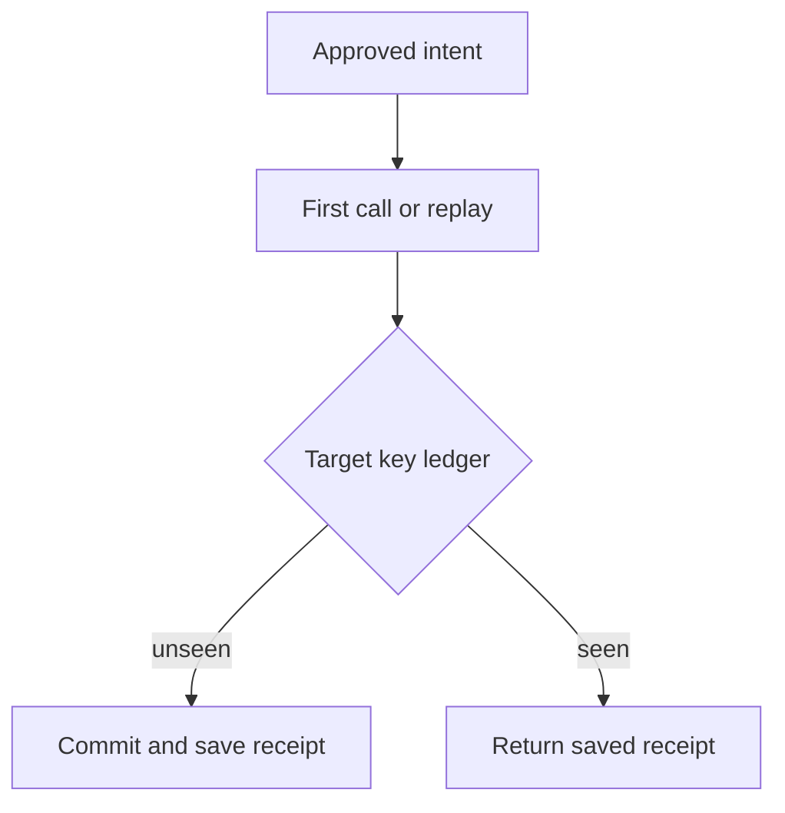

## Threat model

An authorized agent action reaches an external service, but the workflow loses or rewinds the local record before acknowledging completion. A crash, operator replay or adversary-induced retry can cause a duplicate. [LangGraph time travel re-executes downstream API calls](https://docs.langchain.com/oss/python/langgraph/use-time-travel), and [resuming an interrupted node reruns it from its beginning](https://docs.langchain.com/oss/python/langgraph/interrupts). This pattern addresses the workflow-to-target side-effect boundary; it does not assert a defect in LangGraph or any payment provider.

## Control location and owner

1. **Bind intent before dispatch.** The application owner assigns a durable operation key to an approved action, recording tenant, target, recipient, amount or equivalent material arguments, approval ID, policy revision and workflow version. A retry, resumed node or fork performing *the same intent* carries this key; changed material arguments require a new authorized intent. Keep the key independent of mutable node order.
2. **Fence the target mutation.** The target-service owner performs an atomic key lookup/reservation and mutation, scoped to tenant and action type. On an identical duplicate, return the original receipt without repeating the effect. On a same-key/different-arguments conflict, reject and alert. Persist the outcome across process restarts for the entire replay window. If target atomicity is impossible, hold ambiguous attempts for reconciliation; a workflow-local dedupe cache is not equivalent.
3. **Reconcile unknown results.** Before resending after a timeout or crash, query by operation key. Record attempt IDs separately from the stable operation ID, with target receipt and decision; avoid sensitive payment details in routine logs. Alert on a target effect without an approved intent, or on multiple target effects for one operation key.
4. **Protect version transitions.** [Functional API task/interrupt replay is position-sensitive](https://docs.langchain.com/oss/python/langgraph/backward-compatibility). Pin or drain in-flight runs before incompatible graph changes and run old checkpoints against the new code in staging. The key remains attached to the business intent rather than to the program counter.

## Falsification test

In a test target, commit a marker action and kill the worker before the agent records the reply. Resume on the same thread, then independently replay and fork the pre-call checkpoint. Inspect target ledger and receipts: **one side effect, one operation key, multiple attempt IDs**. Send the same key with a changed material argument and demand rejection with no effect. Repeat after target restart, across two simultaneous workers, near key-retention expiry and through an incompatible workflow update. A passing agent trace alone does not pass this test.

## Limitations

External services without an atomic deduplication API may leave an irreducible unknown-outcome window; isolate those actions behind manual reconciliation or a provider-supported unique business reference. Retention has to cover the longest supported replay period, and expired keys must not quietly become new work. Idempotency does not validate the approval or prevent a newly authorized but fraudulent intent. [Checkpoints capture workflow state](https://docs.langchain.com/oss/python/langgraph/checkpointers), not an external ledger; verify both sides.
