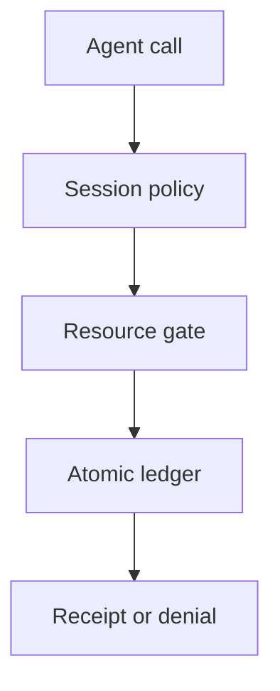

## Threat model and scope

An agent performs a permitted action under a [session-aware tool policy](https://docs.aws.amazon.com/bedrock-agentcore/latest/devguide/policy-temporal.html). A new session, a policy-update conflict or a parallel worker then attempts the same business action under an empty local history. The exploited boundary is **per-session history treated as a durable, resource-wide limit**. This is a design scenario, not a documented breach of AgentCore. [AWS's session guidance](https://docs.aws.amazon.com/bedrock-agentcore/latest/devguide/policy-session-based-temporal.html) says the application chooses when to create a new policy session, and its security notes distinguish per-session from cross-session limits. Authenticated gateways bind histories to principals, but that does not merge separate histories for one principal.

Use this pattern when the invariant belongs to an order, account, invoice, data export quota or approval grant rather than one conversation. Keep temporal policy for useful local ordering, but do not rely on it alone for a global limit.

## Owner and enforcement point

1. **Define the invariant.** The business-resource owner specifies a maximum committed count/amount, eligible actor and resource, expiry, approval requirements and whether reversals release budget. Name the owner of exceptions. The platform owner maintains the gateway session lifecycle and keeps policy in [ENFORCE mode](https://docs.aws.amazon.com/bedrock-agentcore/latest/devguide/policy-enforcement-modes.html), but the resource owner must not outsource the global invariant to it.
2. **Make the target unavoidable.** Route every consequential write—including non-agent clients—through a single resource service. At that service, authenticate the caller, resolve the authoritative account and resource, check current entitlement, then atomically compare and update the resource's committed total and an idempotency record. Serialize competing writes for the same resource; reject a second write that would exceed the limit. Do not accept a caller-provided session ID or model-supplied order label as proof of remaining budget.
3. **Bind retries to one action.** Issue an action key tied to the intended resource, amount and actor before dispatch; store the resulting committed or rejected outcome. A timeout or [policy-change 409](https://docs.aws.amazon.com/bedrock-agentcore/latest/devguide/policy-temporal.html#policy-temporal-concepts) triggers reconciliation, not a new refund key. Reuse the key for an identical retry; reject a changed payload under the same key. When an external processor is involved, preserve its idempotency reference and reconcile uncertain effects before releasing any reservation.
4. **Record independent evidence.** Keep restricted, time-bounded gateway verdict and session references alongside the target's durable actor/resource/key/outcome receipt. Reconcile against the downstream processor's confirmed effects. Alert when a target write has no expected gateway provenance, while recognizing non-agent paths may have a different authorized channel. Never equate a gateway allow with a completed payment.

## Negative and positive tests

Use fake orders and a mock payment sink. In session A, commit one allowed action and capture its target receipt. Attempt a second action for that order in B, then in many fresh sessions; all over-limit attempts must leave the processor's committed total unchanged. Repeat with concurrent sessions so both pass any session-local check at once: the target must serialize the race and commit only what fits. Simulate a lost target response and retry with the same action key: return the original outcome with no additional side effect. Alter the amount while reusing that key: reject it. After a policy update invalidates A, confirm a new session cannot resurrect spent budget. A fresh eligible order must still succeed. Record gateway verdicts, target decisions and processor state; a denial log alone does not prove zero side effects.

## Limits

This does not cure a bypass around the target, a processor that ignores idempotency, or a wrong business entitlement. A cross-region or third-party workflow needs its own atomic authority and reconciliation contract; [temporal policy propagation has documented account and Region boundaries](https://docs.aws.amazon.com/bedrock-agentcore/latest/devguide/policy-temporal.html#policy-temporal-limitations). A resource service outage must stop protected writes or route them to a separately governed manual path. Expose the availability cost and any uncertain external effects instead of calling the system exactly-once.
