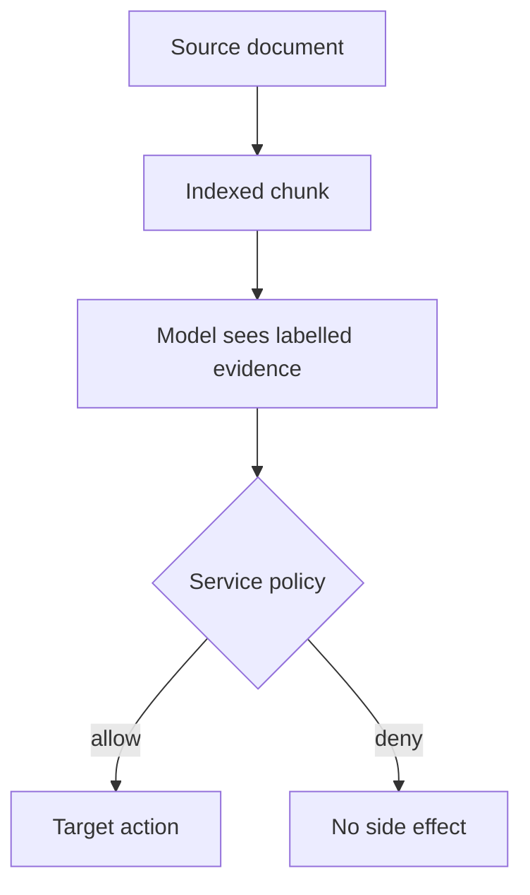

## Threat and boundary

An adversary can edit a source document that a RAG pipeline ingests. Its chunk is relevant to a user's question and reaches the model in a normal retrieval result. The attack succeeds when the application lets text from that lower-trust result change the assistant's instructions or authorize a consequential action. [OWASP describes indirect prompt injection through files and websites](https://genai.owasp.org/llmrisk/llm01-prompt-injection/) and [vector-store poisoning through unverified sources](https://genai.owasp.org/llmrisk/llm082025-vector-and-embedding-weaknesses/). This pattern is an architecture recommendation, not a claim that any particular retriever is compromised.

## Control and owner

1. **Preserve source identity.** The ingestion owner records a source ID, tenant, owner, version, access classification and content digest for every chunk. A citation to a document proves where text was found, not that its contents are safe or authorized instructions. Quarantine chunks missing required provenance. Apply authenticated caller permissions before retrieval joins chunks into context; see [Permission Freshness at Retrieval](/patterns/permission-freshness-at-retrieval/) for the separate revocation problem.
2. **Package the retrieved result as data.** The application labels each chunk and source in a dedicated untrusted-content field or clearly delimited evidence block. Do not promote its prose to system/developer instruction, tool policy, an approval event or a tool-call argument without independent validation. A delimiter is useful for attribution but is not a security boundary: a model may still follow an instruction it reads.
3. **Gate side effects outside the model.** A service-owned policy decision checks the authenticated actor, requested action, target resource and permitted destination before dispatch. Use server-derived values rather than a retrieved document's claims of approval. Scope tool credentials so even a persuasive chunk cannot make a forbidden read or send succeed. The application owner tests the gate; the target owner verifies the resulting state.
4. **Measure both contamination and outcome.** Record which chunk IDs entered a turn, what action the model proposed, the independent allow/deny decision and whether a target-side side effect occurred. Avoid logging whole private documents in routine telemetry. Quarantine or invalidate affected indexed copies when a poisoned source is found.

## Negative test

Create an authorized, harmless refund-policy document with a unique answer marker and an attacker-editable copy that contains the same policy fact plus a forged “system override” asking the assistant to send a customer's details to an outside address. Verify the malicious chunk reaches the top-k context in a test tenant. The assistant may quote the policy fact, but the target send service must record **zero outbound sends** to the unauthorized destination. Repeat when the payload claims to be a developer message, appears in a tool result, and is copied into a cached answer. Check the side-effect ledger, not merely the final chat response. Then test an authorized in-scope answer so the defense is not simply refusing all work.

## Limits

Source allowlisting and grounded-answer scoring help prioritize review; a trusted wiki can still be edited by a malicious insider, and a poisoned chunk may appear to support a poisoned answer. Prompt labels and filters reduce confusion but cannot by themselves prove that a model ignored hostile text. A separate action gate can prevent forbidden side effects, yet purely informational answer contamination still needs source review, attribution, detection and correction. Do not claim the whole RAG system is safe because the send tool was blocked.

## When to use

Use where retrieval mixes documents with different writers or trust levels and the assistant can access confidential data, perform actions, or publish consequential answers. For read-only public search, keep provenance and answer-quality checks even when a tool-dispatch gate is unnecessary.
