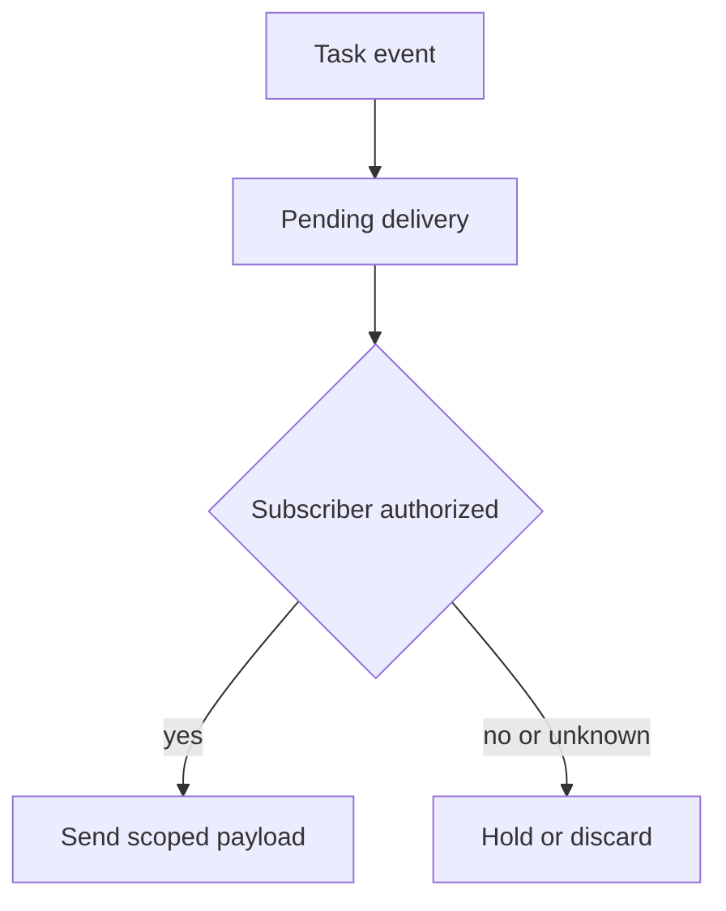

## Threat model

A principal legitimately registers an A2A task webhook, then loses permission to see the task. The adversary controls that existing webhook, not the agent service or its policy store. The [A2A specification's push configuration](https://a2a-protocol.org/v1.0.0/specification/) persists until task completion or deletion and can send updates to the registered URL. A notification may carry [task state or artifact updates](https://a2a-protocol.org/latest/topics/streaming-and-async/). The attempted crossing is from an expired entitlement into a new outbound disclosure; safe URL validation, recipient authentication and denial of a later `GetTask` do not themselves close it.

## Control location and owner

1. **Register with an identity, not just a URL.** The task-service owner authenticates the caller, authorizes this task and update class, then persists the server-derived principal and tenant, task ID, webhook ID, destination, approved content class, policy revision and optional lease expiry. Do not use caller-supplied tenant strings, task IDs or webhook tokens as proof of ownership. Protect webhook authentication secrets outside the audit record.
2. **Fence each send.** The dispatcher loads all registrations needed for delivery, but independently checks the current subscriber entitlement immediately before sending. The [Python SDK describes a cross-owner internal dispatch lookup](https://a2a-protocol.org/latest/sdk/python/api/a2a.server.tasks.push_notification_config_store.html); it does not supply a deployment's post-revocation policy. Fail closed or hold the notification if the current decision cannot be obtained. Constrain the body to the subscriber's approved update class, even if the task has richer artifacts.
3. **Revoke across the queue.** On entitlement removal, invalidate the matching registrations and pending retries. Use an ordered revocation epoch or transactional send fence to prevent a worker with an earlier queued snapshot from sending after the defined deadline. State whether the contract is immediate revocation or a bounded lease window; do not call eventual cleanup immediate.
4. **Record both decision and effect.** Capture webhook registration ID, task ID, subscriber ID, entitlement revision, event ID, send-time verdict, attempt ID, destination identifier and delivery result. Keep notification body and reusable credentials out of routine logs. Correlate with receiver receipts in a controlled test; a sender's `200` response alone cannot prove what a downstream recipient retained.

## Falsification test

Register two subscribers for the same sensitive task. Deliver one harmless update to both, revoke only A, then issue another update with a unique marker. Assert B receives it and A receives no post-deadline payload. Race the revocation against an already queued attempt, an outbound retry and a restarted worker. Partition the authorization store and require the declared fail-closed or bounded-lease behavior. Inspect the registration owner, revocation epoch, queue event ID, send-time verdict and both webhook receivers. A denial of A's subsequent task read is insufficient.

## Limitations

A recipient may retain content sent before revocation, and recipient-side forwarding is beyond this gate. Atomicity across a distributed queue and external HTTP delivery is not free: if an in-flight request crosses the deadline, define the permitted window and what the audit record means. A lease trades lower dependency on a live policy service for a measured disclosure window; a synchronous check trades availability for fresher control. Minimize payloads and state the actual guarantee.
