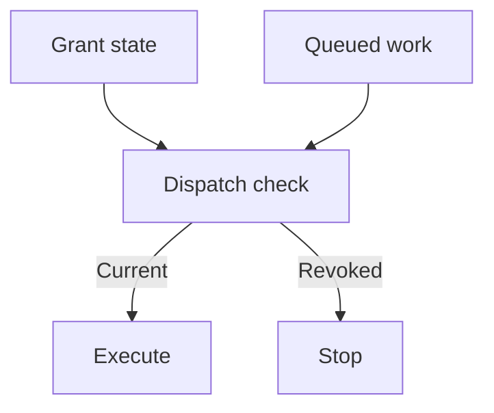

## Context and Problem

A parent task delegates work to independently scheduled agents. Cancellation of one task does not establish that every descendant has stopped or that previously issued credentials have lost their authority.

A2A provides cancellation and places authorization responsibility at the server. The delegation records, budgets and revocation checks below are a proposed platform control, not automatic behaviour supplied by A2A.

## Solution

The platform team operates the delegation store and receiving dispatchers. Each root operation has a business owner, a response owner and an approved maximum lifetime.

1. **Register authority before delegation** — Create a protected record containing the root and parent IDs, tenant, acting workload, represented user where applicable, allowed operations and resources, intended receiver, expiry and revocation state. Bind the record to authenticated identities; untrusted metadata must not create or reparent authority.
2. **Allocate a bounded child grant** — Authenticate the receiver and evaluate local policy. Restrict the child to the intersection of parent authority, receiver policy and any represented-user entitlement. Atomically reserve concurrency and work budget before creating the child. Set a maximum depth, total child count and retry budget.
3. **Enforce at execution** — Validate the grant and ancestor revocation state at each receiving dispatcher, including queued and resumed actions. Use short leases with an explicit maximum staleness if checking centrally on every action is impractical. Deny new consequential work when freshness cannot be established.
4. **Separate stop from confirmation** — An authorised responder changes the root to stopping and denies new grants. Request descendant cancellation, fence queued dispatch and revoke scoped credentials or block their use at the enforcement gateway. Track each action independently.
5. **Reconcile before closure** — Record stopped, completed, failed and unconfirmed descendants. Query target systems for already committed effects or ambiguous outcomes. Require the response owner to resolve unconfirmed workers before marking containment complete, or explicitly record the remaining exposure.

The stop branch also covers expired, stale or invalid grants. This check controls new dispatch; in-flight operations need the separate cancellation and reconciliation steps above.

## Problems and considerations

- A check before dispatch leaves a race with revocation. Use enforcement close to the side effect, bounded leases and resource-level fencing where supported. State the maximum residual window.
- Locally validated bearer tokens may remain usable until expiry. Do not promise immediate revocation without a downstream mechanism that enforces it.
- A disconnected receiver may not process cancellation. Grant expiry must be enforced by that receiver or an unavoidable gateway; centrally recording an expiry alone achieves nothing.
- A budget is ineffective if every child receives its own fresh full allowance. Keep aggregate counters trusted and update reservations atomically across siblings and retries.
- Cross-organisation agents need an agreed cancellation and evidence contract. Where the receiver cannot demonstrate these controls, reduce its authority or exclude consequential delegation.

## Validation

Start a test operation with two descendants, one queued and one running. Revoke the root while a third child is being created. Confirm that the creation race cannot escape the budget or revocation check, the queued action is refused, and the running action is cancelled or reported for reconciliation.

Repeat during a receiver outage and with an unexpired token issued before revocation. Measure time to the last accepted consequential action. Record any uncertain external outcome separately from confirmed cessation. Verify that an agent cannot change its parent ID, extend its own grant or cancel another tenant's operation.

## When to use this pattern

Use this for A2A or other delegated workflows that outlive a single request, especially where agents can change production state, export data or consume significant resources.
