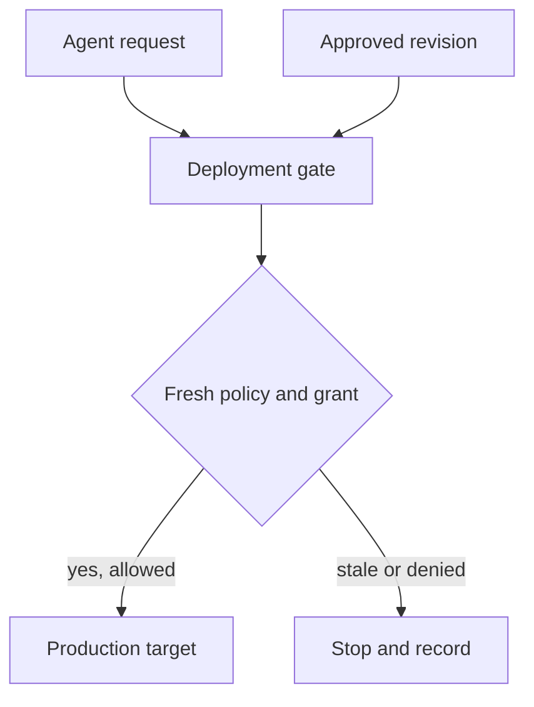

## Threat model

An agent credential remains usable after a grant is revoked. The attacker routes a request to a deployment gate whose local policy replica still contains the grant. The attacker does not need to corrupt the policy engine. The trust boundary is the transition from centrally approved revision to the revision that the final service actually enforces. [OPA bundles propagate in an eventually consistent manner](https://www.openpolicyagent.org/docs/management-bundles); on signature failure OPA retains the old bundle. That fallback is not itself an authorization policy for urgent revocations.

## Control at the gate

1. **Name the owners.** The security policy owner approves revocations and monotonic revision numbers; the platform team operates bundle distribution and observes lag; the deployment owner makes the final allow-or-stop decision. Prevent the agent identity from publishing revisions or changing the freshness limit.
2. **Define the deadline.** For each privileged action class, specify the longest time a gate may use an old revision. After an emergency revocation, mark the previous revision ineligible for that action. Require an authenticated current-revision check or positive gate acknowledgement before new privileged actions; if unavailable, stop them. Reject replayed or rolled-back revisions even if their signatures verify.
3. **Bind decision to execution.** Immediately before dispatch, the gate reads its active revision and fresh entitlement state, evaluates the authenticated actor, target and exact action, then issues a single-use decision binding. Re-evaluate on retry or changed input. Give the deployer no alternate direct route that bypasses this gate.
4. **Reconcile observed state.** Compare each serving gate's active revision and last activation with the approved revision. [OPA's status fields](https://www.openpolicyagent.org/docs/management-status) include both and report activation errors. Correlate the gate's operation ID, revision and target outcome with [decision-log revision and decision ID](https://www.openpolicyagent.org/docs/management-decision-logs); alert on stale allows, missing records and targets changed without a matching fresh allow. Redact sensitive inputs from decision logs.

## Falsification test

Start with a known allowed agent deployment. Revoke the grant and partition one replica before it activates the new bundle. After the stated deadline, try the same deployment through that replica: **the target must not change**. Repeat after a rejected signed update, a restart with a persisted old bundle, and a rollback attempt; check the revision actually consulted, the gate's freshness verdict, the decision ID and the target state. Positive control: a still-authorized agent on a fresh gate can deploy. A dashboard showing only the central policy revision is insufficient evidence.

## Limitations

A time-bounded cache leaves an exposure window. Requiring fresh central checks may halt legitimate deployments during an outage; plan that trade-off explicitly. An out-of-band administrator or stolen target credential can bypass the gate entirely and needs separate authorization and detection. Policy freshness also cannot establish that the *new* policy is correct: review and test the rule before rollout.
