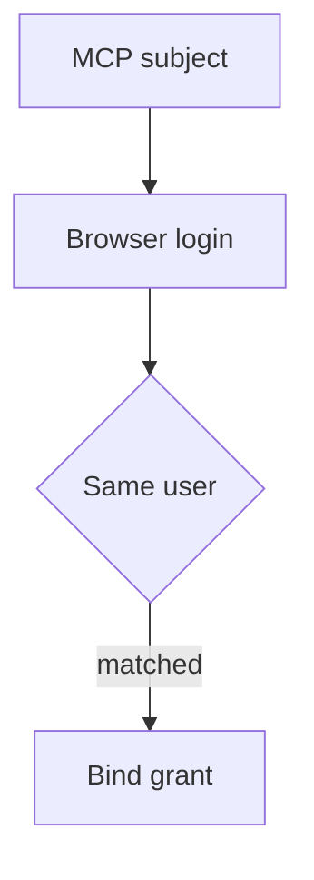

## Context and problem

URL-mode elicitation sends a user out of the MCP client to complete a sensitive interaction. The client does not handle the third-party credentials. But an attacker can share their pending URL with a victim: if the server accepts the victim's authorization callback for the attacker's pending request, it can bind the victim's third-party account to the attacker. The MCP elicitation specification calls out this phishing path and requires the initiating user to be the user who completes the flow.

## Solution

1. **Capture the initiator.** Authenticate the MCP request and store its authoritative subject with a short-lived, single-use pending connection record. Scope it to the intended service and requested grant; do not use a claimed email or mutable client parameter as the subject.
2. **Authenticate the browser.** Point URL elicitation at a server-controlled connect page, not directly at the third-party authorization endpoint. Authenticate the browser visitor independently and compare their subject to the stored initiator before any third-party redirect. A mismatch ends the attempt without binding a grant.
3. **Bind the callback.** Protect OAuth state from tampering and replay; associate it with the pending record and recheck the browser identity when completing it. Store resulting tokens only for the matching principal. A client `accept` means consent to navigate, not proof that the flow finished.
4. **Keep sensitive data out of band.** The client displays the full URL and obtains explicit consent without prefetching it. Neither the URL nor form-mode elicitation carries credentials; the client and model cannot inspect the secure browser interaction.
5. **Test the crossing.** Open Alice's pending URL while authenticated as Bob. Confirm rejection before third-party consent and no new grant for either user. Try a modified subject parameter, a reused callback and an expired pending record. Then confirm Alice's legitimate flow works once.

## Problems and considerations

- A short-lived URL reduces exposure, but possession of the link does not establish the browser user's identity. Avoid pre-authenticated access URLs.
- Callback protection alone prevents state manipulation; it does not replace the initiator-versus-browser comparison. The browser session must be authoritative and maintained through the redirect.
- A valid connection may still request excessive scopes. Review scopes and keep revocation available after binding.
- Different legitimate identities across the MCP service and browser require an explicit, verified account-linking policy, not an automatic fallback to whichever account opened the URL.

## When to use this pattern

Use it for remote MCP servers that offer URL-mode elicitation to attach third-party credentials or authorize transactions for multiple users. It is especially important when URLs can be copied into messages or opened on another device.
