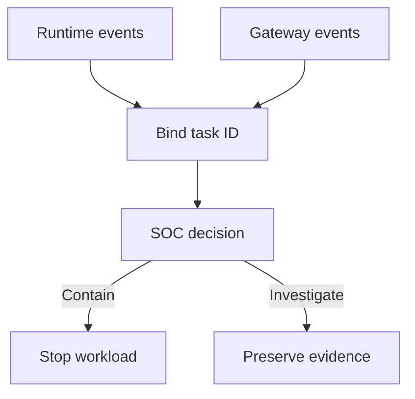

## Context and Problem

An isolation boundary can change the events exposed to host monitoring. Runtime uptime, host sensor health and application behaviour are separate forms of evidence. A green health check cannot establish detection coverage inside a sandbox.

This proposed pattern uses gVisor's documented distinction between workload monitoring and runtime observability as a concrete example. For a VM, native container or another sandbox, validate the equivalent event sources rather than assuming the same integration applies.

## Solution

The runtime team owns isolation and event export. Detection engineering owns the event-to-rule mapping. The SOC owns the response playbook and acceptance evidence.

1. **Specify the contract** — List the behaviours that must be visible, the expected fields, their emitting component and the maximum delivery delay. Include process execution, selected file access, outbound connections, policy denies and workload lifecycle events. Record unsupported operations explicitly.
2. **Select suitable sensors** — Verify support for the exact sandbox and version. Where host events cannot describe guest behaviour, use the runtime's supported monitoring interface or an appropriate guest sensor. Corroborate outbound activity with enforcement-gateway records. Do not weaken isolation or expose a privileged host socket just to make a collector work.
3. **Bind workload identity** — At launch, create a protected mapping from sandbox instance to tenant, agent, task, deployment version and credential reference. Retain lifecycle timestamps so reused names or process IDs do not join unrelated activity. Treat workload-authored trace fields as untrusted until bound to that mapping.
4. **Export beyond the boundary** — Send events to a collector the workload cannot alter. Scope transport credentials, validate event structure and restrict access. Prefer metadata over content; do not collect file bodies, tokens or complete tool payloads by default.
5. **Detect loss and respond** — Monitor heartbeats, event counts, collector backpressure and export failures. Run scheduled canaries through the entire path. For sensitive tasks, define a maximum blind interval after which new dispatch pauses. Keep a separate control path able to stop the workload and restrict its credentials.

The stop action runs through the platform's control path. It is not a command that the potentially compromised agent can choose to ignore.

## Problems and considerations

- A runtime event reports what its instrumentation observed. Corroborate critical effects with gateway or target records, especially if runtime compromise is in scope.
- Event volume and backpressure can remove evidence at the moment it matters most. Test the delivery budget under representative peak load and expose dropped-event counters.
- Detailed syscall tracing may be expensive and sensitive. Use supported production monitoring and measure overhead; do not assume debug logging is a suitable permanent SOC feed.
- Network metadata may identify a destination without identifying the data sent. Record that limit rather than labelling the feed as complete exfiltration detection.
- A pause-on-telemetry-loss policy affects availability. Set it by workload risk and keep its enforcement outside the sandbox being observed.

## Validation

In a disposable workload, execute a harmless process, read a synthetic canary file and attempt an explicitly blocked test connection. Check the workload-to-task mapping, expected event fields, alert delivery and actual network denial independently.

Then interrupt event export without stopping the workload. Confirm the blind interval is detected and the agreed dispatch response occurs. Restore export and check that recovery does not silently discard buffered evidence. Repeat after a runtime or sensor upgrade. Acceptance requires both the expected controls and the expected visibility; passing one does not compensate for failing the other.

## When to use this pattern

Use this when moving agent code into stronger isolation, onboarding a new runtime to the SOC, or claiming that existing endpoint monitoring covers sandboxed execution.
