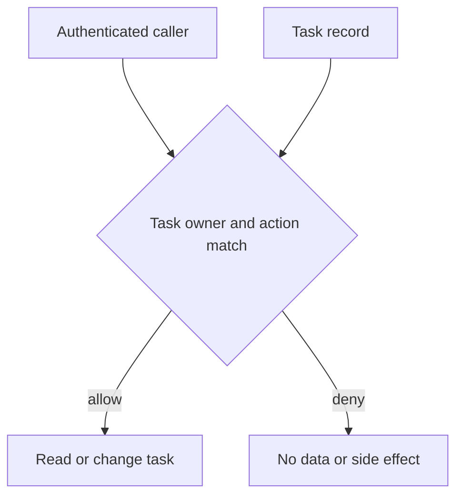

## Context and Problem

A2A tasks can outlive their initiating request. Their IDs travel through logs, links, notifications and client state. A task lookup proves that the object exists, not that the requester can read artifacts or control its lifecycle. A2A 1.0 calls for authorization on every operation that accesses or lists task resources. The A2A .NET SDK security guide leaves authentication and tenant isolation to the application.

The attacker may already have a valid task ID. The design must hold when the ID is known, not just when IDs are hard to guess.

## Solution

1. **Establish the caller** — Authenticate at the transport boundary. Derive principal, tenant and allowed actions from server-trusted identity and policy. Ignore a client-supplied tenant field as proof of entitlement.
2. **Bind at creation** — Persist immutable ownership metadata beside the task, artifacts, streams and push configurations. Delegation should use a separately authorized grant, not silently substitute the receiving agent's service account for the original user.
3. **Scope at access** — Query by both task ID and authorized tenant or owner. Independently authorize `get`, `list`, `cancel`, subscriptions, history, artifacts and notification settings; return no task data on failure. A prior allow does not grant permanent rights after access changes.
4. **Keep the gate across async delivery** — Recheck the relevant ownership and policy when streams reconnect or a push configuration changes. Protect outbound webhook destinations from SSRF separately; task ownership alone does not make a supplied URL safe.
5. **Prove the negative case** — With a task created by A, use its real ID as B to exercise every read and mutation route. Confirm zero artifact disclosure, zero stream events and zero cancellation. Repeat after revocation and resumption.

## Problems and considerations

- Shared tasks may legitimately have several readers. Represent that as explicit membership or delegated grants with expiry and revocation, not a public ID.
- Filtering after an unrestricted list can leak existence, counts or intermediate artifacts. Apply scope at the query boundary.
- A `not found` response can conceal unauthorized existence; keep operator telemetry sufficiently detailed without revealing it to clients.
- Revoking access cannot recall artifacts already delivered. It can stop future retrieval and streaming.
- A2A describes protocol behavior; the precise policy and storage implementation remain the operator's responsibility.

## When to use this pattern

Use it whenever an A2A server stores task state for more than one principal or tenant, supports asynchronous updates, or exposes task history and artifacts. For a genuinely single-tenant isolated deployment, still test task ownership if callers have different permissions.
