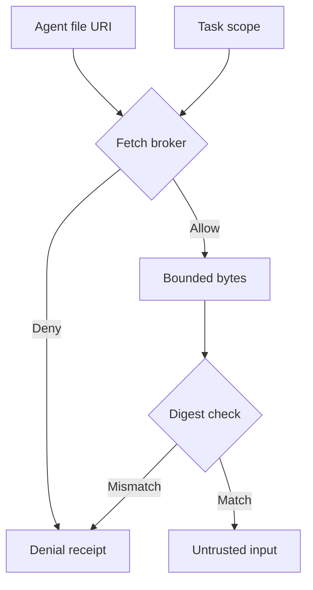

## Threat model

An authorized remote agent supplies a file reference in an artifact; the local receiver has more network access than the remote agent. The [A2A `FilePart` schema](https://a2a-protocol.org/v0.3.0/specification/) allows URI references but does not turn the referenced bytes into an authenticated, immutable result. An attacker controlling the producer or destination can seek internal access, supply the wrong tenant's material, or change content after the reference is accepted. This is a conditional integration threat, not an assertion that an A2A implementation has been compromised.

## Owner and enforcement point

1. **Register task scope.** The receiving application owner records the expected producer identity, tenant, task ID, allowed artifact class, permitted origin or receiver-owned exchange service, maximum bytes, expiry and optional expected content digest or immutable object version. Reject unregistered artifact references. Prefer bounded inline bytes where that avoids an extra fetch.
2. **Fetch at a broker.** The receiving platform's network owner gives the artifact broker no ambient cookies, cloud tokens or internal network route. Parse and check the URI against the registered task policy; reject unsupported schemes and embedded credentials. Bind the connection to validated IPs, preserve host and TLS verification, disable automatic redirects, and deny private, loopback and metadata routes in network policy. If redirects are essential, repeat authorization and connection checks for each hop. [OWASP's SSRF guidance](https://cheatsheetseries.owasp.org/cheatsheets/Server_Side_Request_Forgery_Prevention_Cheat_Sheet.html) motivates defense at both application and network layers.
3. **Admit exact bytes.** Enforce response and decompression limits, inspect actual type, and calculate a digest of the bytes delivered to the ingestion pipeline. Compare an expected digest or immutable version if one was registered. Keep source metadata and document text in a lower-trust channel; do not promote artifact text into tool permissions or system instructions.
4. **Make an auditable decision.** Record task and producer IDs, policy revision, redacted URI origin, destination class, fetch verdict, byte digest, and ingestion receipt. A [signed URL is usable by its possessor while valid](https://cloud.google.com/storage/docs/access-control/signed-urls); store its full query only in a restricted secret-bearing evidence store if necessary, not in general traces.

## Falsification test

Set up a harmless internal HTTP canary and a public test object. Return a syntactically valid file URI from the expected producer for the wrong tenant, a public redirect to the canary, a public DNS name whose later answer is private, and a document whose bytes change between task registration and retrieval. For every destination or tenant violation, demand zero canary requests and zero ingested bytes; compare broker logs with canary logs. For changed content, demand rejection when a digest was pre-registered, otherwise a receipt naming the *new* digest and no assertion that the earlier version was consumed. Also test a signed URL in a response: its query must not appear in general traces or model input.

## Limits

A digest proves byte identity, not correctness. A task-scoped origin can be compromised; a signed URL can expire or be leaked before it is fetched. If the application needs to prove what a reviewer saw, retain the fetched snapshot under governed access rather than relying on a live URL. A network gate must be operated and tested independently of the application parser; an allowlisted host alone does not solve DNS rebinding or malicious document instructions.
