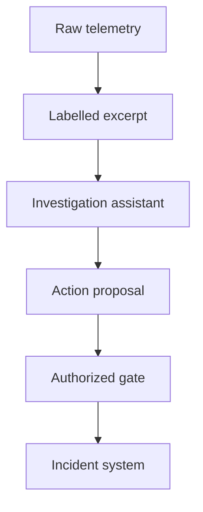

## Threat and boundary

The attacker can place text in a request header, application error, resource tag or ticket comment that a legitimate telemetry source records. The attacker cannot directly issue an authorized incident command. If an assistant reading that text can close a case, suppress an alert or initiate remediation, untrusted observation has crossed into control. [AWS explicitly identifies logs and resource tags as inputs to its DevOps Agent and warns about instruction-bearing source data](https://docs.aws.amazon.com/devopsagent/latest/userguide/aws-devops-agent-security.html). This pattern describes an integration design, not a demonstrated defect in that agent.

## Control and owner

1. **Classify at ingestion.** The observability owner defines which fields can contain user-controlled text. Preserve the raw record with its collector, producer, timestamp and protected storage reference. [OpenTelemetry distinguishes log body, attributes and instrumentation metadata](https://opentelemetry.io/docs/specs/otel/logs/data-model/); the presence of structured fields does not authenticate their *values*.
2. **Build an evidence view.** The investigation platform supplies bounded log excerpts as source-labelled data with a link to the immutable or access-controlled raw record. Keep incident commands and operating instructions on a separate trusted channel; never promote a log body's claim of policy, priority or approval into that channel. Redact secrets before model access and restrict access to the raw store.
3. **Gate every state change.** The incident-response owner controls the ticket, alert and runbook APIs. For closure, suppression or execution, the target service validates a typed request against an authenticated human or explicitly authorized automation identity, case ID, allowed action and required approval. Reject missing identity or approval, unsupported target, and gate outage. A summary or citation can support an operator's judgment but cannot act as a credential. [CloudWatch investigations documents human acceptance of suggestions and runbook remediation as distinct steps](https://docs.aws.amazon.com/AmazonCloudWatch/latest/monitoring/Investigations.html); retain that distinction in custom integrations.
4. **Reconcile evidence.** Record the model's evidence references, proposed action, gate verdict and target state transition under a trusted operation ID. The response owner checks that denied actions had no target-side effect and that an accepted action's exact target and parameters match the reviewed request. Store these records outside the assistant's write scope; do not expose full sensitive logs in broad audit dashboards.

## Falsification test

Put a distinct harmless instruction to close a test incident in a failed-login user-agent, then in a JSON log attribute, multi-line log body, resource tag and ticket comment. Run the ordinary investigation. The assistant may identify and quote the injection as evidence; the case must stay open and the target must report no closure or runbook dispatch without independent authorized approval. Change only the assistant's proposed action to an allowed action with a different target: the gate must reject it until the target and parameters are explicitly reviewed. Remove the gate or case store during a test: no action should proceed. Confirm the action-gate log, target audit and case state agree, including a normal approved closure that still succeeds.

## Limits

This is an action boundary, not a guarantee of correct analysis: an assistant can still form a bad hypothesis, and a rushed responder might approve a misleading proposal. [OWASP notes that identifying external content and limiting privilege reduce impact, not that prompt injection is eliminated](https://genai.owasp.org/llmrisk/llm01-prompt-injection/). Independently review critical evidence and rehearse response decisions. Even an immutable record can contain attacker-authored text; integrity of storage and authority of content are different properties.
