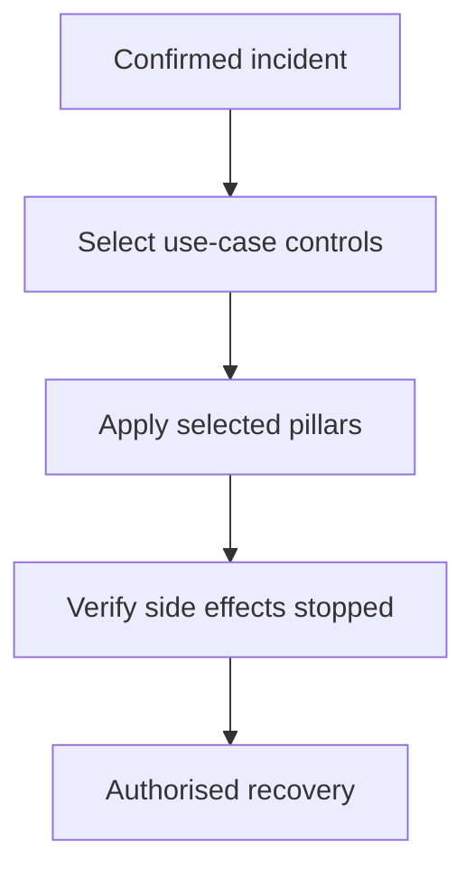

## Context and Problem

An organisation needs to contain an AI system whose behaviour, account or runtime may be compromised. A single stop action rarely covers issued credentials, network paths, queued work, delegated agents and effects already committed to target systems.

NIST's AI RMF Playbook calls for planned risk responses, resources and continuous monitoring. NIST SP 800-61 Rev. 3 places incident response inside wider cybersecurity risk management. The three pillars below translate that preparation into an agent containment design; they are a proposed architecture model, not terminology defined by either publication.

## Solution

The security architect defines the required containment outcome for each use case. Platform, identity, network and application owners implement the controls. Incident response owns invocation, coordination and closure evidence.

1. **Map the action surface** — Record every workload identity, credential, connector, gateway, destination, runtime, queue, schedule and delegated service through which the agent can cause an effect. Include vendor-operated and cross-organisation components. Assign an owner and an emergency contact to each unavoidable boundary.
2. **Remove authority** — Disable the workload identity or agent account, revoke delegated grants and connector consent, invalidate supported tokens and deny new tool calls at policy enforcement points. RFC 7009 supplies an OAuth token-revocation mechanism, but it does not cover every credential type or guarantee that every downstream cache checks immediately. State the maximum residual authority window.
3. **Restrict connectivity** — Block agent egress and ingress at gateways, service meshes, host controls or vendor integration points. Disable tool, MCP and A2A routes selectively where possible. Retain tightly scoped responder, telemetry and evidence paths so isolation does not make containment unverifiable.
4. **Stop execution** — Pause triggers, schedulers and queues before stopping workers, containers, virtual machines or services. Fence queued and resumed work. Request cancellation of remote tasks, but do not treat acknowledgement as cessation: the A2A specification states that cancellation success is not guaranteed.
5. **Verify and recover** — Test each enforcement point with a harmless synthetic action, enumerate in-flight and delegated work, and reconcile target-side outcomes. Record confirmed stopped, completed and unknown states separately. Restore one capability at a time through an authorised recovery decision; do not let the agent restore itself.

| Use case | Authority | Connectivity | Execution |
| --- | --- | --- | --- |
| Endpoint or server agent | Disable workload identity and revoke tokens | Isolate host or deny agent egress | Stop process, service and local scheduler |
| Cloud or PaaS agent | Deny managed identity and tool grants | Block gateway, private endpoint or service route | Pause trigger and scale workers to zero |
| SaaS agent | Revoke connector consent and service grants | Disable vendor integrations or target access | Disable agent and scheduled workflows in the vendor control plane |
| A2A workflow | Revoke root and descendant grants | Block receiving agent routes | Fence queues and cancel every known task |

The response may apply pillars in parallel or in a use-case-specific order. The diagram describes governance stages, not a mandatory technical sequence.

## Problems and considerations

- Revoking a refresh token may not invalidate every access token or copied secret. Inventory credential semantics and test enforcement latency rather than assuming "revoke" is immediate.
- Network controls can strand evidence or block the responder. Separate the containment path from the agent data path and pre-authorise the minimum management route.
- Terminating a parent process does not stop remote descendants or undo completed changes. Track delegation lineage and reconcile target systems.
- A broad switch can create greater harm than the incident in safety-critical or customer-facing services. Define safe-state behaviour, compensating controls and staged containment before deployment.
- Vendor-operated agents may expose only coarse tenant controls. Make containment functions, response times and evidence access contractual requirements; reduce autonomy where they remain unavailable.

## Validation

Run a controlled exercise with one local action, one queued action, one delegated task and one external state change. Invoke each pillar separately and then the approved combined response. Measure time to the last accepted action, last network connection and last running worker.

Repeat while one control plane is unavailable and while a credential remains unexpired. Confirm that responders retain access, telemetry continues through the approved path, ambiguous outcomes stay open and the agent cannot reverse containment. Recovery should require a separate authorised action and produce a complete audit trail.

## When to use this pattern

Use this for agents that can invoke tools, reach enterprise data, modify external state, execute code or delegate work. Apply more than one pillar whenever a single residual capability could sustain the incident.
