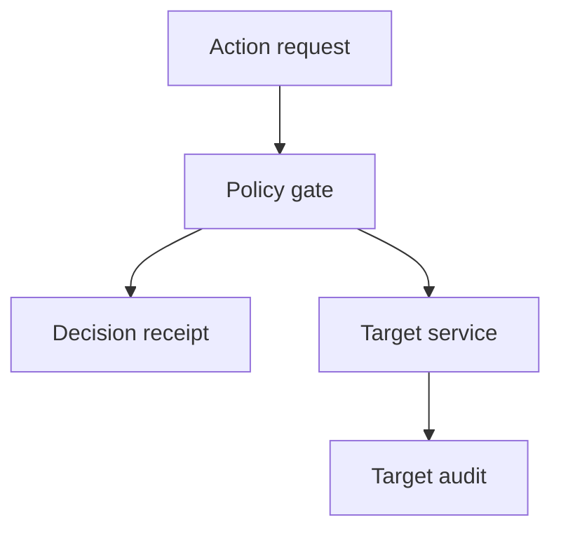

## Boundary and owner

An agent or caller can request a consequential action and can influence trace context; it must not decide whether a security event is recorded. The gateway team owns enforcement and receipt production; the target-service team owns the authoritative side-effect record; security operations owns reconciliation. [OpenTelemetry head sampling can drop a trace before an error is known](https://opentelemetry.io/docs/concepts/sampling/), and [a `DROP` sampling decision discards span events](https://opentelemetry.io/docs/specs/otel/trace/sdk/). A normal trace is not a complete authorization ledger. This pattern addresses a design risk, not a known product vulnerability.

## Construction

1. **Define consequential verbs.** Inventory exports, writes, credential access, external sends and administrative changes at the service boundary. Route all supported clients, including direct API callers, through a gateway or equivalent target-side authorization. If that route cannot be enforced, the receipt cannot prove coverage.
2. **Write a minimal receipt before dispatch.** The gate creates a server-owned operation ID, authenticates the actor and checks action, resource, purpose and current policy version. Persist a typed receipt with those identifiers, decision, reason code and timestamp outside the sampled tracing pipeline. Require confirmed persistence for high-risk allows and denials; if it fails, block that class of action and alert. Keep secrets and content out; apply access control and bounded retention. [OWASP's logging guidance](https://cheatsheetseries.owasp.org/cheatsheets/Logging_Cheat_Sheet.html) calls for logging design, tamper detection and failure testing, not indiscriminate full-payload capture.
3. **Record the effect at the target.** The target accepts the operation ID only alongside valid gateway authorization; it records received, committed or rejected against its own state transition. A denial must not be forwarded. Keep the target record under independently governed permissions so an agent cannot rewrite both sides.
4. **Reconcile and test completeness.** Join receipts and target events by operation ID, actor and target; alert on changes with no receipt, allows with missing final outcome, duplicate IDs, and receipt-store or target-audit gaps. [Collector processors can deliberately filter spans](https://opentelemetry.io/docs/collector/transforming-telemetry/); trace sampling and filtering must not alter either receipt stream. Reconcile with target-state queries for critical actions rather than trusting the mere absence of an audit event.

## Falsification test

In a test tenant, make the trace sampler drop an agent's denied export. The trace backend may have no record; the decision receipt must exist and the target must show no export. Allow a different export and require the exact target outcome to join to the allow receipt. Attempt the same export by calling the target directly with the agent's credentials: it must not succeed. Disable the receipt store for a high-risk action and verify fail-closed behavior; disable target auditing separately and require a completeness alarm rather than reporting a clean denial. Check actual target state for both cases, then restore a normal approved action to verify availability after recovery.

## Limits

Independent receipts improve accountability but do not prove that a compromised target reported honestly or that an attacker never used a path outside the inventory. A durable ledger is a high-value asset and a potential privacy liability. Use service-owned identities, separated write permissions, retention limits, gap monitoring and periodic route inventory. Trace sampling can remain aggressive for diagnosis; the security claim rests on enforcement coverage and two independently governed records, not on the observability dashboard.
