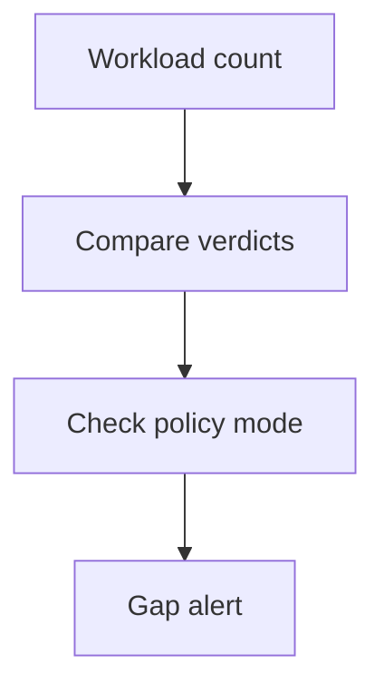

## Threat model

A policy service times out, rejects a large transcript, or is bypassed by configuration rather than by an attacker defeating its classifier. An operator sees few denials and concludes traffic is safe. In [Claude Enterprise Inference hooks](https://platform.claude.com/docs/en/manage-claude/inference-hooks), the configured failure mode governs what happens when the endpoint cannot return a verdict; [shadow mode, sampling and exclusions](https://platform.claude.com/docs/en/manage-claude/inference-hooks-configuration) can also leave work unblocked or uninspected. This is a deployment assurance pattern for the documented surfaces, not an allegation of a product breach. The exploited boundary is an **unverified policy invocation being mistaken for an enforced allow decision**.

## Owner and enforcement point

1. **Declare coverage.** The organization security owner records the governed applications, user classes, data classes and tool actions, plus approved exceptions. Require enforcing mode, full rollout, no unapproved excluded roles and **Validate tool calls** wherever tool-call coverage is required. Capture changes to these settings as security-relevant events. [The configuration guide](https://platform.claude.com/docs/en/manage-claude/inference-hooks-configuration) documents the distinct modes and rollout behavior; do not conflate “enabled” with “blocking.”
2. **Count independently.** In a restricted observability service, compare an application or platform request count to signature-verified policy-server verdict receipts and available platform activity by time window and scope. Deduplicate deliveries by the [endpoint's `webhook-id`/`request_id`](https://platform.claude.com/docs/en/manage-claude/inference-hooks-endpoint#design-your-integration). Track allowed, denied, timed out, explicitly excluded, unsampled, off, shadow and breaker-window traffic as different states. If platform counts do not expose an exact denominator, state the coverage bound and alert on that uncertainty instead of reporting 100%. Retain only IDs and aggregates needed for reconciliation; keep any sensitive transcripts under separate access and retention policy.
3. **Treat missing verdicts as an incident signal.** For high-risk scope, select fail-closed, alert on errors and breaker trips, and test recovery. [Platform activity semantics](https://platform.claude.com/docs/en/manage-claude/inference-hooks-configuration#audit-trail) include fail-open uninspected events but not per-request events during a tripped breaker; use the breaker event to mark an entire unknown-coverage window. Do not interpret an empty policy-server log or healthy-looking panel as no requests.
4. **Keep action control independent.** The execution owner places a separate authorization gate on protected reads and writes, bound to actor, target, parameters and current entitlements. The [OWASP AI Agent Security Cheat Sheet](https://cheatsheetseries.owasp.org/cheatsheets/AI_Agent_Security_Cheat_Sheet.html#tool-authorization-middleware) calls for enforcement outside the model. A hook verdict on a prompt is not a reusable grant for all downstream actions; failure of the hook must not grant a high-impact tool access.

## Evidence and falsification test

Maintain a time-bounded record of configuration revisions, endpoint receipt IDs and verdicts, platform denial/uninspected/breaker activities, independent workload totals, ledger gap alarms, and target-side action receipts. Before release, run harmless allow and deny canaries to prove normal blocking. Induce endpoint timeout, HTTP error and an oversized transcript in a disposable scope; in fail-closed, none may complete protected inference, and in an explicitly permitted fail-open scope the missing-verdict count must rise and the protected target must record **zero** unauthorized effects. Switch to shadow, lower rollout, add an excluded role, then disable tool-call validation in controlled tests: the ledger must flag coverage loss rather than present those requests as inspected. Trip and recover the breaker with a defined rollback window; require a breaker-window alert even when no per-request hook records exist. After recovery, observe a fresh denied canary and verify the target ledger, not only a configuration screenshot. Never use live confidential data to test a deliberate fail-open path.

## Limits

No external ledger can certify all traffic unless its workload counter covers every relevant path; record unknown scope rather than inventing a denominator. The [hook's documented limitations](https://platform.claude.com/docs/en/manage-claude/inference-hooks#current-limitations) exclude raw attachment bytes and certain requests or tool calls; account for those separately. Fail-closed enforcement trades availability for inspection, and the independent action gate needs its own coverage and outage tests. This pattern proves which requests were gated, not that a classifier's allow verdict was correct.
