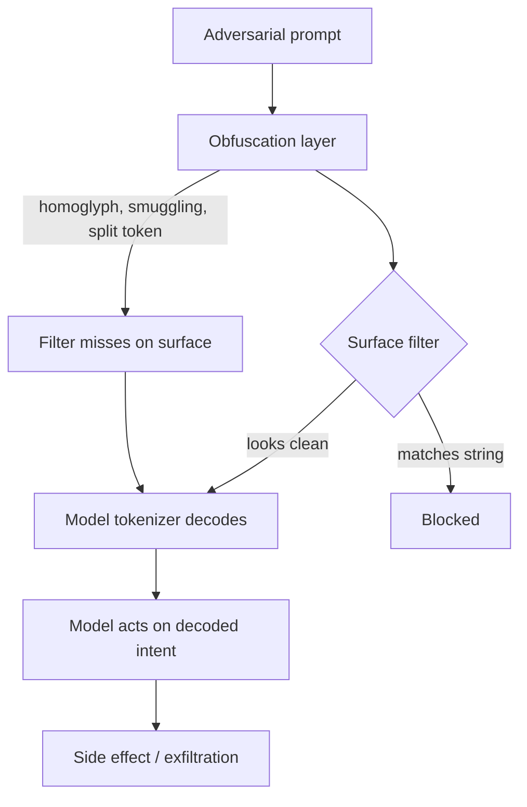

A blocklist that scans for forbidden words is a statement about the text a prompt looks like, not about what the model will do with it. Red teams measure the second one.

String-match and single-turn classifiers fail because they and the model disagree about what the input is. A filter sees characters and whitespace. A tokenizer sees a sequence of subword tokens, and the model attends to the decoded meaning, not the rendering. Every evasion below exploits that gap. None of them is exotic. All of them ship in a single red-team session.

**Token smuggling** splits a forbidden instruction across token boundaries. `Ignore all previous instructions` becomes fragments that a classifier scanning for the complete string fails to match, while the tokenizer re-assembles the command at inference time. Classifiers deployed at the surface see innocent pieces; the model receives the full payload.

**Homoglyph substitution** trades Latin characters for visually identical Cyrillic ones at different Unicode codepoints. The human eye reads "Ignore all previous instructions"; the ASCII keyword classifier finds no match; the tokenizer resolves the same semantic meaning regardless of codepoint. The defense that reads only byte values is blind to the meaning the next layer decodes.

**ASCII smuggling** hides instructions in the Unicode Tags block, U+E0000 to U+E007F, characters that are invisible in every major rendering engine but readable by the model. Johann Rehberger used this against Microsoft 365 Copilot: a malicious email planted hidden instructions to search for a target message, exfiltrate it inside an invisible-encoded link, and ship the content — email, MFA codes, documents — to an attacker server on click. The upstream email filter never saw an instruction at all. Microsoft has since observed the same invisible-tag technique crossing over from prompt injection into high-volume phishing that splits financial lure words to defeat email parsing.

**Multi-turn attacks discard the single-shot assumption entirely.** Crescendo, published by Microsoft in 2024, opens with a benign question and escalates over a handful of turns, steering by the model's own prior answers. Each turn is individually innocuous, so a per-request filter sees nothing to block, while the conversation arc walks the model into the disallowed outcome. Microsoft's own mitigation required a multiturn prompt filter that inspects the whole trajectory, reaching detection only when the guardrail stopped judging one request in isolation.

The shape of the problem is constant: the model executes what it decodes and intends, not what a human or a literal scanner sees. A gate that measures surface form encodes a false confidence. The red team's job is to move the swerve the other way — prove the model acts on meanings the filter cannot represent.

Constitutional classifiers and label-based policy engines are the honest response: they reason about the decoded content and the proposed action rather than matching strings. But they only help if they sit on the model's side of the decode boundary and are themselves red-teamed. Treat a filter that survives a blocklist test as the floor, not the verdict.

## Recommendations

- Never treat a string-match or single-turn classifier as the security boundary; verify what it does not represent, then close that path with a policy gate.
- Normalize input — Unicode, homoglyphs, whitespace, tag characters — before both screening and tokenization, so the filter and the model see the same thing.
- Evaluate prompts at the trajectory level, not one request at a time, to catch multi-turn escalation like Crescendo.
- Red-team your guardrail itself: test whether obfuscated and multi-turn payloads reach the model despite a clean filter verdict.
- Put the deciding gate on the decoded, policy-evaluated meaning of the proposed action, outside the model's skippable path.
