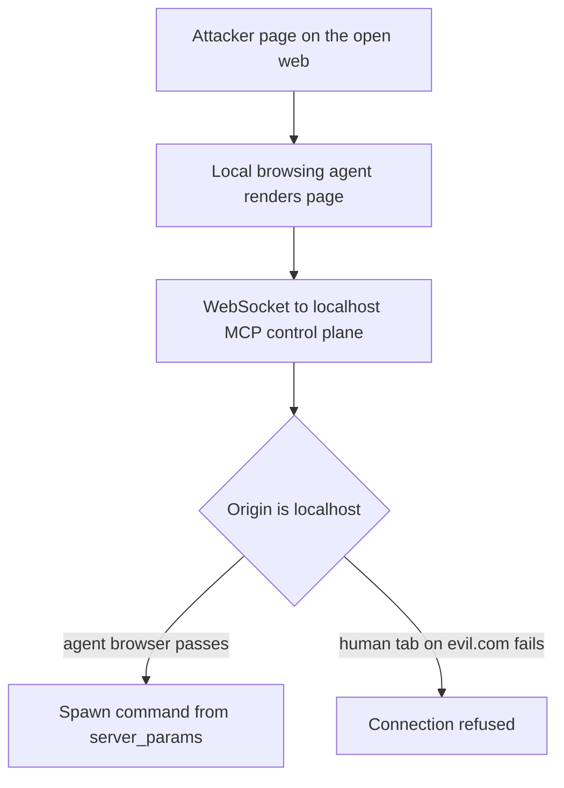

A localhost Origin check answers which browser process opened the socket. It does not prove a human chose the page.

Developer control planes often allowlist `http://127.0.0.1` and `http://localhost` on WebSockets. That blocks a tab on evil.com. It does not block a headless browser owned by an agent on the same machine. Anything that agent renders inherits the localhost identity. The residual is not a missing bind to loopback. It is treating localhost Origin as a trusted user.

Microsoft Defender Security Research named that chain AutoJack on 18 June 2026. In AutoGen Studio’s MCP WebSocket surface, three weaknesses stacked. The Origin allowlist accepted the agent’s local browser. Auth middleware skipped `/api/mcp/*` on the assumption the handler would check, and the handler never did. The route took a base64 `server_params` query value, decoded it into `StdioServerParams`, and spawned `command` plus `args` with no executable allowlist. A page the browsing agent rendered could open `ws://localhost:8081/api/mcp/ws/?server_params=…` and run an attacker-chosen process under the developer account. Maintainers hardened main in commit `b047730`: server-side parameter binding, MCP paths back through auth, and an executable allowlist. Stable PyPI `0.4.2.2` never shipped that MCP route. Pre-release `0.4.3.dev1` and `0.4.3.dev2` did.

The Cloud Security Alliance AI Safety Initiative published an independent note on 22 June 2026. It restates the same three-link chain and the packaging nuance: pip-stable installs were not on that surface, while source and `--pre` builds were. CSA’s architectural residual matches Microsoft’s. Localhost Origin is not synonymous with trusted user action. It can mean code running in the agent’s browser sandbox. Any local service a browsing agent can reach is part of that agent’s attack surface.

Authenticate every privileged local control plane, including WebSockets, even when the Origin is loopback. Do not skip MCP or debug paths in middleware. Store process-spawn parameters server-side behind a short-lived session id. Allowlist which executables may start as tool servers. Keep browsing agents off the same host identity as the control plane: separate OS user, container, or VM, with no shared localhost privilege. Otherwise the residual is a green Origin check and a shell the developer never asked for.

## Recommendations

- Require authentication and authorization on every local agent control plane, including WebSocket and MCP routes, with no localhost-only exception.
- Refuse client-supplied command lines for tool servers. Bind parameters server-side and allowlist executables.
- Do not co-locate a browsing or code-execution agent with an unauthenticated localhost control plane on the same host identity.
- Inventory developer prototypes that expose MCP, debug, or stdio spawn sockets on loopback and treat them as high-value attack surface.
- Prove in tests that an agent-rendered page opening `ws://127.0.0.1/...` cannot spawn a process when auth and allowlists are removed.
