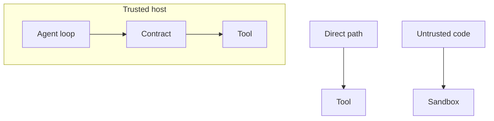

Agent Hooks is a contract between a host and a set of interceptors. It can prove that a host stopped an action, but only if the host actually asks the contract first.

Agent Hooks interceptors run in the same process as the host, so they can see every field that process already holds. Registering an interceptor lets it change or stop every action the agent takes, which is the right shape for a contract with a trusted runtime and the wrong shape for a wall.

The contract does not sit on every path: background work can skip `pre_tool_call`, and so can a direct tool call. Some tools run on a hosted service rather than in the host process, so they never pass through the tool hook and show up later, at `post_model_call`. A call that never hits the contract is not a failed deny; it is a path the contract never saw.

A conformance suite can test a host that cooperates, but it cannot catch a host that skips the hook. A sandbox is a different control, built to contain code you do not trust. Mixing the two is how you get a false boundary: the report is green on the paths that asked, while the incident is on the path that did not.

Put the contract on the runtime that will ask it, and put isolation (process, identity, or network) around anything you do not trust. The hook proves that the action stopped; the sandbox is what stops the host that never asks.
