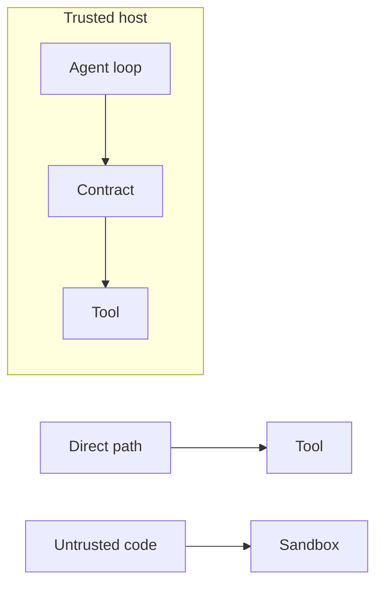

A governance contract can make a cooperating host's deny testable. It cannot become the wall around a host that never asks.

Agent Hooks interceptors run in-process with full data access. Registering one is write access to every action the agent takes. That is the right shape for a contract with a trusted runtime. It is the wrong shape for a boundary.

There is no complete-mediation claim. Background work or direct tool execution can skip `pre_tool_call`. Server-side hosted tools never hit the tool seam; they surface at `post_model_call`. A skipped path is not a failed deny. It is a path the contract did not see.

Conformance makes a cooperative host's claims testable. A sandbox contains untrusted code. Mixing the two is how you get a false sense of a boundary: a green conformance report on the paths that asked, and an incident on the path that did not.

Put the contract on the cooperating runtime. Put isolation — process, identity, network — around anything you do not trust. The hook proves the deny. The sandbox is what stops the host that never asks.
