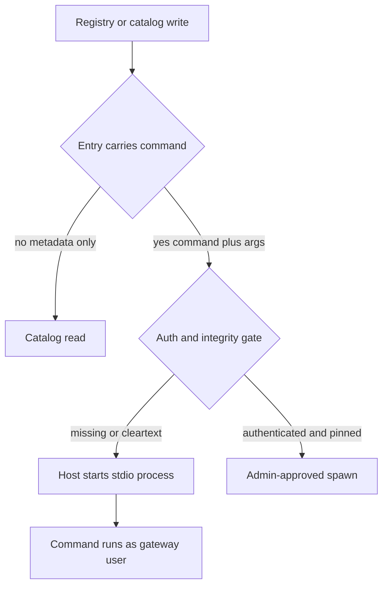

A registry entry that names a command is an admission to execute, not a catalog browse.

MCP gateways and agent hosts often fetch or accept client registrations that include `command` and `args`, then start those programs as local stdio processes. The architectural residual is what that path proves. If registration or catalog fetch can rewrite the command without an authenticated, integrity-checked admission gate, the operator has enabled process start from a management surface. Logs that record "client registered" or "catalog synced" are recording a spawn, not a read-only discovery step.

On 14 September 2026, JFrog disclosed `CVE-2026-90898` in Bifrost HTTP transports before `2.1.0`. Bifrost registers MCP clients through its management API. A stdio client is a command plus args. Bifrost starts that program in the gateway the moment the client is added. No MCP handshake is required. The default is `governance.auth_config.is_enabled=false`. Auth off means every reachable caller is a local admin. One unauthenticated `POST /api/mcp/client` is enough to run a program as the Bifrost process user. The HTTP request may time out while Bifrost waits for a handshake. The process is already running.

The same residual class appears when the catalog itself is the spawn list. `atomic-agents-stack` before `1.1.0` (`GHSA-xhcr-cqfr-m3hv` / `CVE-2026-91988`) accepted cleartext `http` URLs in its HTTP MCP server-registry backend. Catalog entries carry `command` and `args` that are type-checked but content-unrestricted. `MCPClientPool` later spawns those values as local stdio subprocesses. Over a cleartext catalog URL, a network man-in-the-middle can rewrite the response and obtain code execution on the agent host with no LLM involvement. The Policy MCP allowlist is not a default mitigation. Absent an operator-authored allowlist, every resolved spec connects and runs.

Treat every MCP client registration and remote catalog fetch as a containment claim only when the path that admits `command` and `args` requires authenticated admin identity, refuses cleartext catalogs by default, and does not start the process until that gate passes. Prove in tests that an unauthenticated register and a rewritten cleartext catalog both fail closed. Otherwise the residual is a green "client added" event and a host process the operator never approved.

## Recommendations

- Require authenticated admin identity before any management API path that registers a stdio MCP client or loads a plugin.
- Refuse cleartext `http` MCP catalogs by default; gate `http://` behind an explicit opt-in and pin or checksum catalog contents.
- Do not spawn registry-supplied `command` and `args` until an allowlist or confirmation gate has approved the resolved basename.
- Keep the management listener off untrusted networks when dashboard authentication is disabled or unconfigured.
- Prove in CI that unauthenticated `POST` registration and a rewritten cleartext catalog response are denied before process start.
