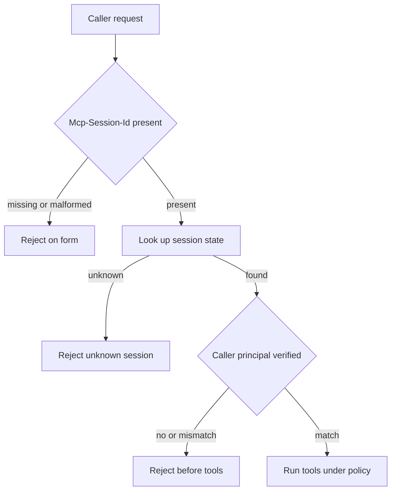

A protocol session identifier associates requests with conversation state. It is not proof of caller identity.

MCP HTTP transports mint an `Mcp-Session-Id` so a stateless connection can resume the same logical conversation. That value is useful for continuity. It is easy to mistake for a gate. Format checks and UUID lookup answer “does this request belong to a known session?” They do not answer “who is presenting it, and may they act?”

On 2 September 2026, Pillar Security showed the gap on Grafana’s official MCP server. Before v1.1.0, a reachable caller could invent a session-shaped string, for example `mcp-session-` plus a UUID, and attach it to `tools/list` and `tools/call`. The server accepted the requests with no credential. It then ran tools, including `grafana_api_request`, under the Grafana service-account token configured on the MCP host. Grafana’s own audit saw authenticated traffic from the wrong principal. The residual was not a missing regex on the header. It was a continuity token standing in for inbound authentication. Grafana shipped optional bearer-token caller auth in v1.1.0 so unauthenticated requests receive `401` before any tool runs.

The MCP Python SDK hit the same category error from the other side. GHSA-jpw9-pfvf-9f58 (CVE-2026-52869) covered SSE and stateful Streamable HTTP before `1.27.2`. Those transports routed requests by session identifier alone. They did not check that the authenticated principal matched the principal that created the session. A different bearer-authenticated client with a known session ID could inject JSON-RPC into that session. On Streamable HTTP, the injecting client could also read the response. The fix records the creating principal and answers a mismatched principal with the same `404` used for an unknown session.

Treat a session ID as a state handle only. Require an independent caller credential on every privileged request. Bind that credential to the session at creation and re-check it on later messages. Otherwise the residual is a green path for anyone who can present a well-formed continuity token.

## Recommendations

- Require inbound authentication on every remote MCP transport before `tools/list` or `tools/call` runs.
- Bind each session to the authenticated principal at creation, and reject later requests from a different principal.
- Treat `Mcp-Session-Id` as a conversation handle only; never accept a locally invented format match as a credential.
- Prove in tests that a forged session header without a valid bearer token receives `401` or `404` before side effects.
- Scope the MCP service account to the minimum backend permissions the enabled tools need.
