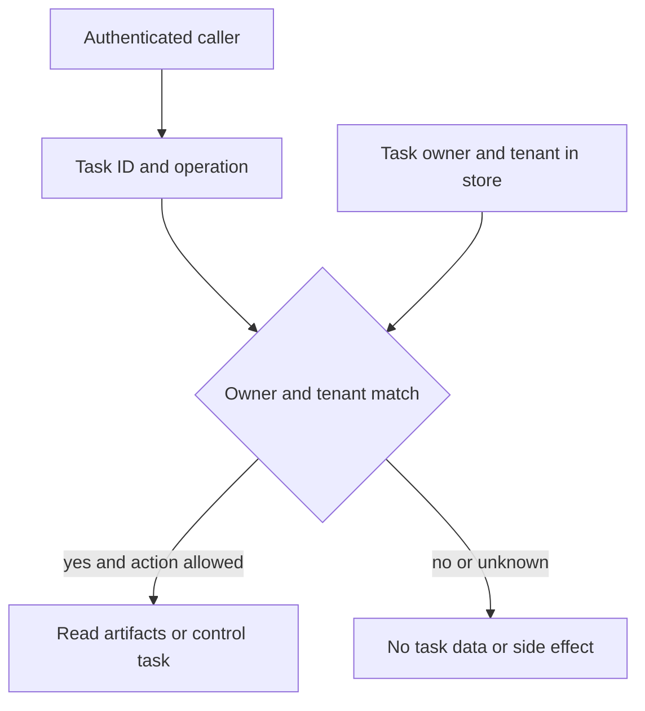

The attacker does not have to persuade the agent to do something new. Sometimes it is enough to ask about work the agent has already done for someone else.

A2A tasks persist beyond the request that created them. A client can fetch a task and its artifacts, subscribe to updates, or ask to cancel work. A task ID is useful for locating that state; it is not evidence that the caller owns it. If the server retrieves by ID and then assumes the lookup was authorization, the attack moves from prompt injection to an ordinary cross-tenant read or control-plane action.

The A2A 1.0 specification requires authorization checks on operations that access or list tasks and scope results to the authenticated caller. That is a protocol requirement, not a guarantee that an SDK has enforced it for an application. The A2A .NET SDK security guide makes the division explicit: the SDK handles protocol mechanics, but endpoint authentication, per-method and per-tenant authorization, and task-store isolation belong to the application. It warns that task IDs, push configurations and artifacts are not inherently scoped to a caller.

Consider two customers using the same incident-response agent. Customer A submits a task that produces an incident timeline. Customer B obtains or guesses a task ID from a log, URL, notification or predictable ID sequence. A global `get(taskId)` can return A's timeline to B; a global cancel can stop A's work. An unguessable ID reduces casual discovery, but does not repair an authorization decision missing from `get`, `list`, `cancel` or subscription. The relevant object is the stored task, bound to the principal and tenant established at creation.

The boundary is at every task operation, not only at task creation. Resolve tenant and principal from trusted authentication, persist ownership with the task, and make the storage query itself tenant-scoped where possible. Recheck subscriptions and webhook configuration against the same ownership record. Log the decision without leaking artifact bodies or bearer credentials. Then test the bad path: create a task as A, call each operation as B using the real ID, and prove that B sees no content, receives no stream and causes no cancellation.

## Recommendations

- Bind each task and artifact to a server-derived tenant and owner when created; never take tenancy from an untrusted request field.
- Enforce owner and action checks on get, list, cancel, resume or subscribe, and push-configuration operations, including retries and reconnections.
- Use non-predictable task IDs as defence in depth, not as a replacement for authorization.
- Test cross-tenant access with a *known, valid* task ID; a test using only random nonexistent IDs does not exercise the boundary.
- Separate denial telemetry from task content so a failed lookup does not become an information leak.

Related pattern: [Task-Bound A2A Authorization](/patterns/task-bound-a2a-authorization/).
