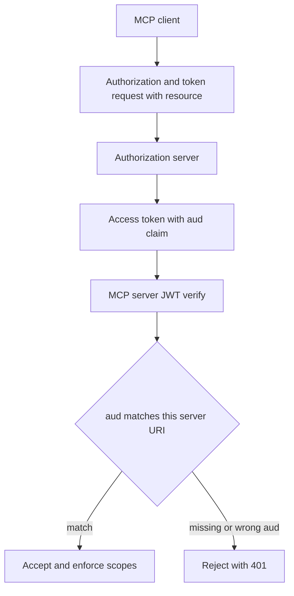

A bearer token that verifies under the right issuer is still not a grant for this server.

Signature, expiry, and issuer checks answer who minted the credential. Audience answers where it may be spent. An MCP server that skips the `aud` claim still accepts tokens minted for another server that trusts the same issuer. An authorization server that never binds a `resource` parameter into that claim issues the same reusable credential. The residual is not missing OAuth. It is treating validation as complete when the intended recipient was never checked.

The MCP authorization specification makes that check mandatory. Since the `2025-06-18` revision, clients MUST send RFC 8707 Resource Indicators on both authorization and token requests, naming the canonical URI of the target MCP server. MCP servers MUST validate that presented access tokens were issued specifically for them as the intended audience. They MUST reject tokens that omit them from `aud` or otherwise fail to prove they are the recipient. The same section forbids token passthrough: a server MUST NOT forward the client token upstream. Without that binding, multi-server agent sessions inherit a reusable credential across trust boundaries.

WorkOS documented the same residual on 3 September 2026 in its MCP authorization walkthrough for the `2026-07-28` spec. It names the `resource` parameter and server-side audience validation as requirements that are not new and are still widely omitted. AuthKit guidance matches the residual in practice. If you skip registering the MCP endpoint as a resource indicator, tokens carry a default environment audience instead of the server URI, and the `resource` parameter is ignored. Verification that checks issuer and signature but never sets `audience` to the canonical MCP URI still accepts a token that was never bound to that server.

Treat every remote MCP server as its own resource. Clients must request a separate audience-bound token per server URI. Servers must verify issuer, signature, expiry, and `aud` against one canonical URI with no trailing-slash drift. Do not accept tokens with a missing audience in production. Do not pass a received bearer token to an upstream API. Pair audience binding with short-lived access tokens so a leak at one server does not become a long-lived pass for the estate.

## Recommendations

- Require RFC 8707 `resource` on both authorization and token requests, using the MCP server's canonical URI with no trailing-slash ambiguity.
- Configure JWT verification so `aud` is required and must equal that canonical URI. Reject missing or mismatched audiences with HTTP 401.
- Register each MCP endpoint as a resource indicator at the authorization server so issued tokens carry the server URI, not a shared environment default.
- Mint a separate access token per MCP server in multi-server agent sessions. Do not reuse one bearer across servers that share an issuer.
- Ban token passthrough. Upstream calls use a token issued for the upstream audience, never the inbound client token.
