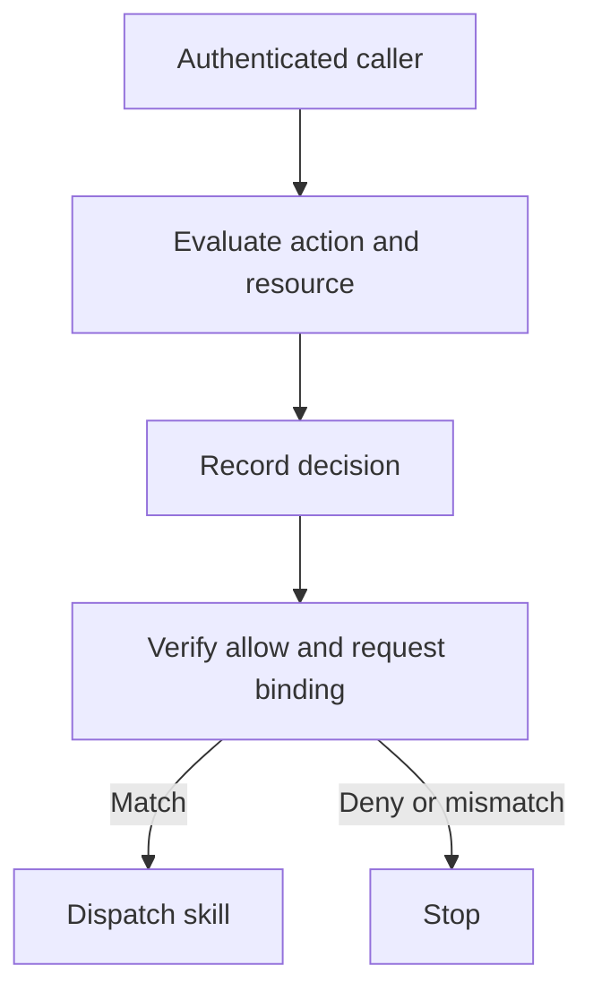

The receiving agent authenticated the caller and ran the skill. When responders ask why the call was allowed, the logs show a principal and a success status. The authorization decision is missing.

Identity, authorization and audit evidence answer different questions. Google Cloud Agent Identity provides an agent with a SPIFFE-based cryptographic identity. That helps establish who connected; it does not, by itself, explain why a particular action against a particular resource was permitted.

A2A 1.0 places authorization at the receiving server. Agent Cards can declare security requirements, including requirements for individual skills, but the server must enforce its own policy. A declaration in a card cannot demonstrate that the check happened for the call under investigation.

Consider an agent that can read incidents and close them. Its identity is valid in both cases. To explain a closure, responders need the requested action, target incident, acting agent, represented user and policy decision. A generic “skill succeeded” event loses that distinction.

The proposed control is an authorization decision receipt: a server-generated record linked to the exact request before dispatch. Record both allow and deny outcomes. For an allow, the dispatcher must verify the binding and expiry before running the skill. Caller-supplied metadata cannot grant permission.

This receipt is an architecture choice, not an A2A protocol requirement. It proves which decision governed execution; it cannot prove that the policy was sound or the caller uncompromised. Where existing authorization logs already provide that binding, use them.

## Recommendations

- Enforce authorization at the receiving agent; treat Agent Card requirements as declarations, not proof that policy ran.
- Emit the receipt from the policy decision point, not from caller-supplied metadata.
- Record the actor and represented user, skill, action, resource, task or context ID, policy version, outcome, timestamp and request digest.
- Store credential identifiers or hashes, never reusable credentials or raw tokens.
- Bind the receipt to dispatch, store it append-only, correlate it across retries and downstream hops, and fail closed if an allowed decision cannot be recorded.

Related pattern: [Skill Grant on the Hop](/patterns/skill-grant-on-the-hop/).
