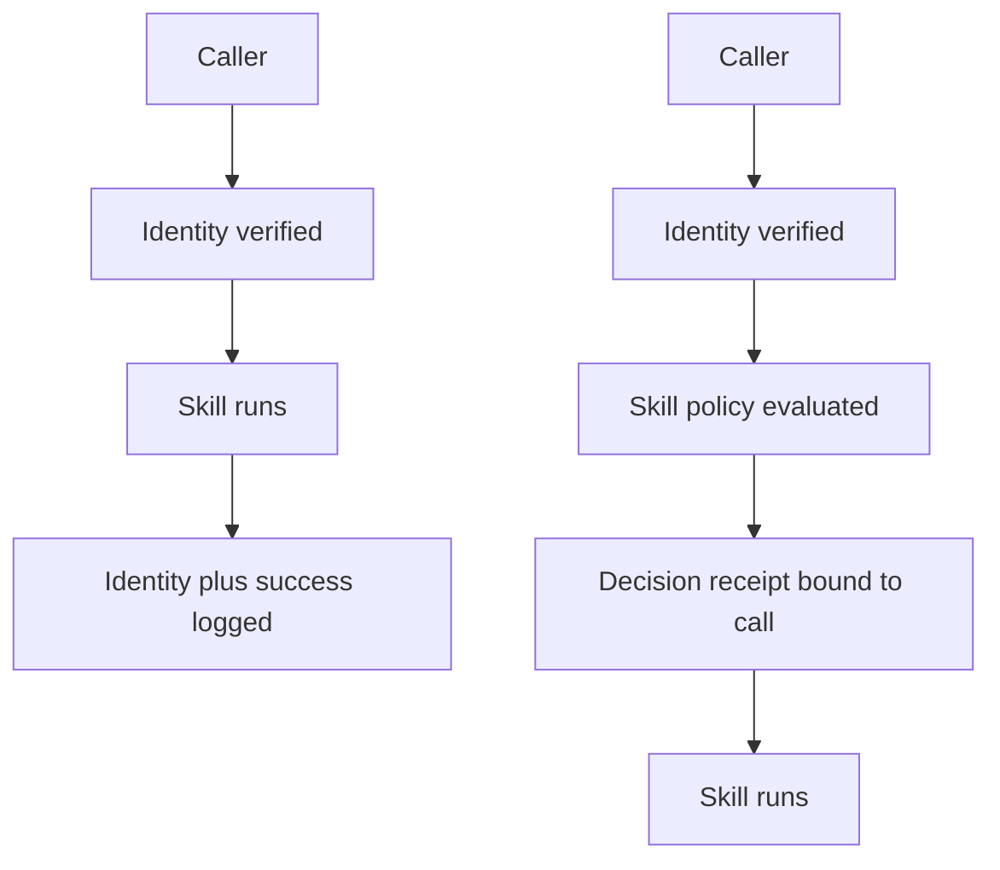

The hop authenticated. The skill ran. Incident response still cannot show why it was allowed.

Identity, authorization and evidence are three different records. Google Cloud Agent Identity gives each agent a strongly attested SPIFFE ID and managed X.509 credentials. IAM can then grant that principal access. Neither feature, by itself, guarantees that the receiving agent records the exact skill-level decision it made for a particular call.

A2A 1.0 is not silent on authorization. An Agent Card can declare security requirements for the agent and for individual skills. After authentication, the server is responsible for authorizing each request against its own policy. The protocol deliberately leaves that policy implementation-specific, however, and it does not prescribe a durable, per-call authorization record.

That distinction matters during an AML.T0053 (AI Agent Tool Invocation) investigation. A valid SPIFFE identity answers who connected. An execution log shows that something ran. Neither tells a responder which policy version allowed which actor, skill, action and resource at that moment.

The missing object is an authorization decision receipt: a tamper-evident record emitted by the server-side policy decision, bound to the call that is about to run. It is evidence of enforcement, not a bearer credential and not a claim the caller gets to write.

An authenticated hop can be secure and still be unauditable.

## Recommendations

- Enforce authorization at the receiving agent; treat Agent Card requirements as declarations, not proof that policy ran.
- Emit the receipt from the policy decision point, not from caller-supplied metadata.
- Record the actor and represented user, skill, action, resource, task or context ID, policy version, outcome, timestamp and request digest.
- Store credential identifiers or hashes, never reusable credentials or raw tokens.
- Bind the receipt to dispatch and fail closed if an allowed decision cannot be recorded.
- Keep receipts append-only and correlate them across retries and downstream hops.

Related pattern: [Skill Grant on the Hop](/patterns/skill-grant-on-the-hop/).
