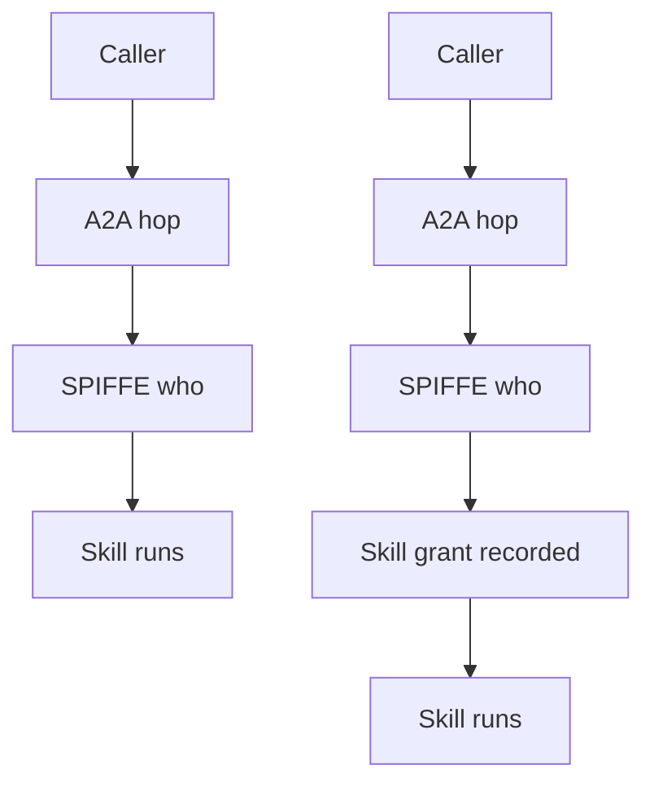

The hop authenticated. Nobody can say who authorized the skill.

SPIFFE can prove which agent spoke. Google Cloud Agent Identity assigns each agent a strongly attested SPIFFE ID and short-lived X.509 credentials, then maps that principal into IAM. That is real identity on the wire. It is not a recorded grant that this caller may invoke that skill under that principal on this hop.

A2A makes the gap structural. The protocol tells agents how to advertise credentials in an Agent Card. It does not define an authorization framework for which peer may call which skill. ZITADEL’s agent-to-agent write-up states the split plainly: authenticate the agent, then separately authorize the specific skill. Skip the second check and you have a signed conversation with no recorded grant.

MITRE ATLAS maps the hop as AML.T0053 (AI Agent Tool Invocation): an authenticated peer invokes a skill across the A2A boundary. For IR, SPIFFE answers who spoke. Without a skill-scoped grant record on that hop, you still cannot answer who authorized that skill, for which principal, at that moment. The decision chain breaks in the timeline.

Identity without a receipt is a signed shrug.

## Recommendations

- Require a skill-scoped grant record on every A2A hop before the skill runs.
- Treat SPIFFE or Agent Card auth as identity proof, not authorization.
- Log who decided, which skill, which principal, and which hop together.
- Deny skill calls that arrive with identity alone and no grant artifact.
- Prefer per-agent attested identity (SPIFFE-class) over shared service accounts for the identity half of the check.
