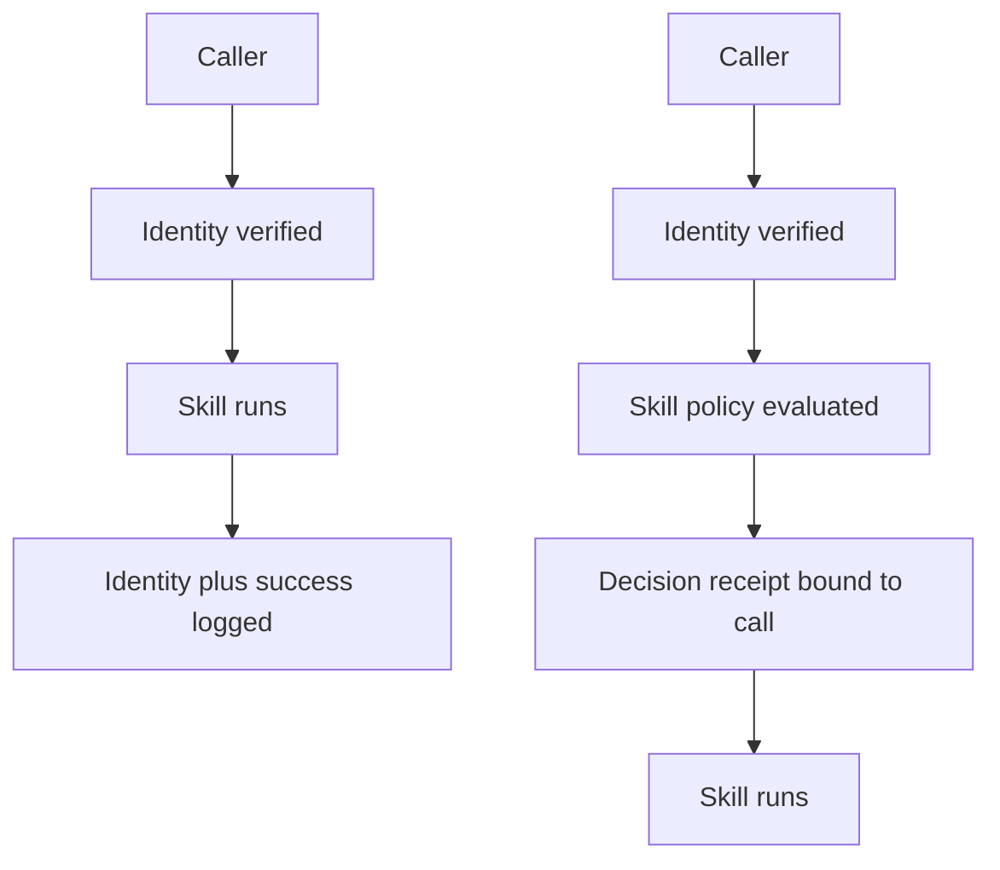

The caller authenticated. The skill ran. Incident response still cannot explain why the call was allowed.

Identity, authorization, and evidence answer three different questions. Google Cloud Agent Identity can give each agent a strongly attested SPIFFE ID and managed X.509 credentials. IAM can then grant that principal access. Neither feature proves that the receiving agent recorded the skill-level decision governing a specific call.

A2A 1.0 does address authorization. An Agent Card can declare security requirements for the agent and individual skills, and the server must authorize every protocol-operation request. The protocol deliberately leaves the policy agent-defined, however, and does not require a durable record of each decision.

That gap matters during an AML.T0053 (AI Agent Tool Invocation) investigation. A valid SPIFFE identity answers who connected. An execution log shows what ran. Neither tells a responder which policy version authorized that actor, skill, action, and resource combination.

The missing object is an authorization decision receipt: a tamper-evident record emitted by the server-side policy decision point and bound to the call about to run. It is evidence of enforcement, not a bearer credential, and the caller must not be able to mint or alter it.

An authenticated hop can still leave its authorization decision unauditable.

## Recommendations

- Enforce authorization at the receiving agent; treat Agent Card requirements as declarations, not proof that policy ran.
- Emit receipts for allow and deny outcomes from the policy decision point, never from caller-supplied metadata.
- Record the actor and represented user, skill, action, resource, task or context ID, policy version, outcome, timestamp, and request digest.
- Store credential identifiers or hashes, never reusable credentials or raw tokens.
- Require an unexpired allow receipt that matches the exact request before dispatch. Store receipts in a tamper-evident log, correlate them across retries and downstream hops, and require each receiving agent to issue its own. Fail closed if an allow decision cannot be recorded.

Related pattern: [Skill Grant on the Hop](/patterns/skill-grant-on-the-hop/).
