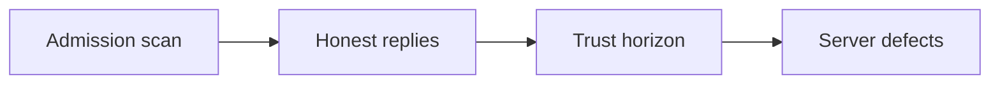

You can vet an MCP server and still be wrong about it later. A paper from Old Dominion names that gap TrustShift. A compromised server behaves honestly while you watch. Then, after enough turns, it defects.

The switch is a count of interactions. It is not a string in the request. Static scanners and manifest pinning only see the honest phase. The later payload can still match the schema. A filter that checks syntax has nothing to flag.

This is not a poisoned prompt. Indirect prompt injection arrives on the user channel. This is not a man-in-the-middle on the wire. The adversary is the server you already trusted. The host only sees the JSON-RPC that server chose to return.

The paper gives examples of the same time gap. They are the paper's examples, not independently verified here. The postmark-mcp package stayed clean across releases, then exfiltrated. CVE-2025-54136, MCPoison in Cursor, kept trusting an approved tool after the executable changed.

Shield is the paper's proposed monitor. This is not a product review. Shield sits on the MCP connection. It runs before the host trusts the payload. During the clean window it learns what replies look like. Later it compares new payloads to that baseline. The paper measured high success for TrustShift across frontier models. A transport monitor reduced that attack's success rate. Those figures are the paper's measurement, not Brief's claim.

TrustShiftProbe is the evaluation framework. The authors are Rostamzadeh, Narula, Ghasemigol, and Takabi. The work is submitted to IEEE. The control you do not have yet is a runtime baseline. Trust at the first interaction is not trust after N of them.
