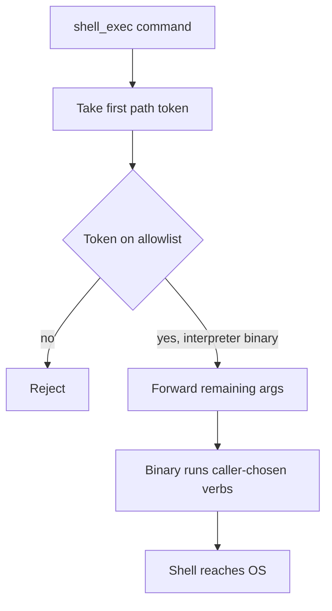

An executable allowlist that stops at the first path token is a name check, not a command policy.

Secure Mode for agent shell tools often advertises a closed set of binaries. The architectural residual is what those binaries are allowed to do once selected. If validation matches `/bin/bash` or `/usr/bin/git` and then forwards the remaining arguments unchanged, the allowlist has authorised an interpreter or a tool that can spawn one. Operators who read `security_enabled: true` as containment are reading a path match, not a proof that only listed verbs ran.

On 14 June 2026, `mcp-shell` published `GHSA-3x77-wg38-92r3` (`CVE-2026-55581`) for versions before `0.6.0`. The shipped Docker `security.yaml` included `/bin/bash` in `allowed_executables`. The validator took the first whitespace token as the executable and checked it against the list. It did not reject shell command-mode flags such as `-c`. A caller of `shell_exec` could send `/bin/bash -c id` and run binaries that were never on the allowlist. A direct `id` call was blocked. Secure Mode reported enabled. The process still executed arbitrary commands as `mcpuser`.

The same residual class appeared on a different allowlisted binary. `GHSA-74hp-mggr-hv58` (`CVE-2026-55582`) records that default `security.yaml` also allowed `/usr/bin/git`. The argument validator omitted `!` from its shell-metacharacter checks and applied no per-executable argument policy. Git treats an alias value that begins with `!` as a shell command. A caller could pass `git -c alias.pwn=!id pwn` and have Git invoke `/bin/sh -c` under the mcp-shell user. The allowlist still said git. The process that ran was a shell.

Treat every Secure Mode allowlist as a containment claim only when each allowed binary has an argument policy that forbids interpreters, command-mode flags, and alias-to-shell escapes. Remove shells and alias-capable tools from default allowlists. Prove in tests that `/bin/bash -c` and `git -c alias.*=!` fail closed with Secure Mode enabled. Otherwise the residual is a green security flag and a process that still runs what the model asked for.

## Recommendations

- Remove shell interpreters and alias-capable binaries such as `bash`, `sh`, and `git` from default Secure Mode allowlists.
- Enforce per-executable argument policies that reject command-mode flags (`-c`) and shell-alias constructs (`alias.*=!`) before execution.
- Prove in CI that an allowlisted path cannot reach `/bin/sh -c` or equivalent through its own flags.
- Do not treat `security_enabled: true` as evidence that only listed verbs ran.
- Prefer typed, non-shell tools for agent file and git work instead of a general `shell_exec` surface.
