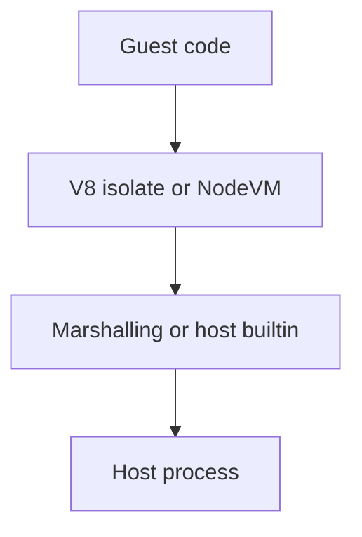

The guest heap can be separate. The host process can still be owned.

Language sandboxes sell a clean story: untrusted code runs in its own isolate or NodeVM, so the agent or workflow host stays safe. That story is half true. A V8 isolate really does give the guest its own heap and built-ins. What fails is often not that primitive. It is the glue that copies values across the boundary, or the host modules the sandbox is allowed to call.

In August 2026, Endor Labs reported a critical type confusion in `isolated-vm` (`GHSA-864f-rcv7-6rh4`). The V8 isolate held. The bug lived in `ExternalCopy` when it handled `transferList`: one walk validated ArrayBuffers, a second walk transferred them without checking again. A getter could pass the first walk and confuse the second. From a single shared `ivm.Reference`, guest code reached host memory corruption and control-flow hijack. The fix in 7.0.1 and 6.2.0 blocks JavaScript during the copy. The residual for architects is blunt: a sound isolation primitive is not a host boundary until the marshalling layer is closed.

The same month, `vm2` published `GHSA-m5w8-4gq2-6f8x`. Under the documented `builtin: ['*']` pattern, NodeVM admitted `os` and `dns` through a readonly proxy that still forwards method calls into the host. Guest code could read host identity and network topology, then call `dns.setServers` and replace the process-wide DNS resolver list. That write outlives the sandbox call. Every later host lookup can follow the attacker’s resolver. The patch in 3.11.6 denies those builtins. The residual is the same class: an endowment that looks sandboxed still mutates host state.

Treat “runs in an isolate” as a containment claim only when you can prove the guest cannot reach host memory, host builtins that write process state, or other endowments that cross back. If you cannot prove that, the label is isolation and the residual is host write access.

## Recommendations

- Inventory every Reference, transfer path, and builtin endowment shared into agent or workflow sandboxes.
- Prefer deny-by-default builtins; never treat `builtin: ['*']` as a safe full grant.
- Patch and pin sandbox libraries the same way you pin auth libraries; treat guest-to-host escapes as Critical.
- Prove host DNS, process priority, and memory stay unchanged after untrusted guest runs in CI.
- Separate “isolate on” from “containment verified” in risk language and control tests.
