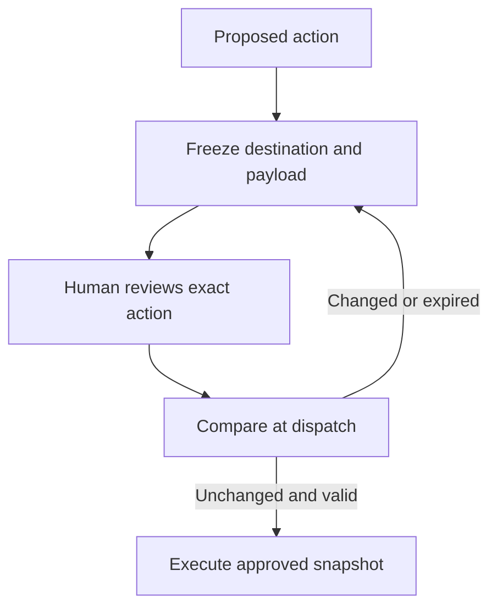

An agent asks to send a report to an internal colleague. The user approves. Before dispatch, the recipient changes or the attachment is regenerated. If the harness remembers only that the user clicked “approve”, a different action can inherit the original permission.

That is a transaction integrity problem. OWASP’s transaction authorization guidance calls for server-side enforcement, protection against changes to transaction data, a final check at execution and operation-specific authorization with a limited lifetime. Applied to agents, the implication is straightforward: approval belongs to the concrete action presented for review.

A task ID is too broad. A tool name is too broad. Even a file path is insufficient if its contents can change while the agent waits. The approval needs to identify the destination, payload and resource version that the reviewer actually saw.

For an email tool, the platform could store the resolved recipients, message body and immutable attachment versions in a protected action record. The review screen reads that record. After approval, the dispatcher sends those same bytes. If the agent edits the report, it creates a new action requiring review.

The same rule must survive a queue, a resumed conversation and a downstream agent. Delegation does not transfer a blanket right to reinterpret the request. A retry needs an idempotency strategy so a lost response cannot become a second send.

This extends the [dispatch boundary](/the-guardrail-that-waved-traffic-through/) into the period between review and execution. Human involvement helps only when the approved action remains identifiable all the way through.

## Recommendations

- Render the review from a server-controlled action record, including the destination and material side effects.
- Bind approval to immutable payloads or resource versions, the approver and an expiry.
- Invalidate approval when any security-relevant field changes.
- Recheck current permissions immediately before dispatch; approval cannot override a revoked entitlement.
- Test delayed execution, changed attachments, duplicate delivery and delegation with an altered target.

Related pattern: [Approval Bound to Action](/patterns/approval-bound-to-action/).
