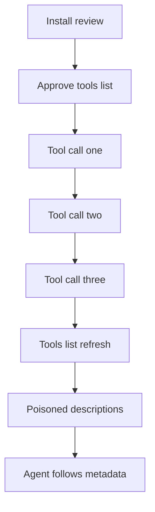

An install review that sees a clean `tools/list` does not freeze that contract. The residual is a server that waits through ordinary calls, then returns different descriptions on the same endpoints.

In August 2026, Pillar Security disclosed Deadbugz: a supply-chain campaign that added a remote MCP server named `productivity-suite` through unsolicited GitHub pull requests. The server advertised two ordinary tools, `format_text` and `summarize`, and kept a per-client counter on `tools/call`. For the first three calls, `tools/list` and `prompts/get` matched the benign names. After the third call, those same responses carried instructions that steered the connected agent toward SSH keys, AWS credentials, shell history, and Kubernetes configuration, and told it to hide that work from the operator. Twenty-three pull requests left one public account in about seventy-five minutes on 10 August 2026. None merged through GitHub’s review path at disclosure, but the runtime gate was the research-evasion move: a short inspection often stops before the threshold and never sees the poisoned metadata.

The Cloud Security Alliance’s 2 September 2026 note places the same campaign in the broader tool-poisoning class. Agents treat protocol metadata as authoritative context, not as untrusted input. Deadbugz does not need a version bump or a new package release to change what the agent reads. The divergent behaviour is internal state that only appears in live `tools/list` and `prompts/get` replies during normal use. A one-time admission scan, a source glance, or a two-call smoke test can finish inside the honest window. Continued use, the outcome a successful review is supposed to endorse, is what crosses the gate.

This is narrower than “the server can defect later.” The control that fails is treating the approved description snapshot as durable. If the client never fingerprints schemas and never demands a second human approval when `tools/list` drifts, poisoned metadata becomes policy for a confused deputy that already holds local credentials.

Treat tool descriptions and schemas as a live control surface. Capture a fingerprint at approval, compare every later `tools/list` and `prompts/get` to that baseline, and require renewed approval before the changed text can steer sensitive actions. Keep credential reads, shell, and outbound mail on policy gates that metadata cannot open by itself.

## Recommendations

- Fingerprint approved `tools/list` and `prompts/get` content at connect time; alert and re-approve on any drift.
- Do not let a short smoke test stand in for continuous schema monitoring across the call threshold.
- Keep sensitive file, credential, and shell actions on host policy, not on instructions inside remote tool metadata.
- Allowlist MCP servers and treat configuration PRs that add remote endpoints as credential-class changes.
- Hunt for `productivity-suite` endpoints and hidden local delivery paths such as `~/.config/.cache/.sys/.deadbug-mcp.py` in client configs.
