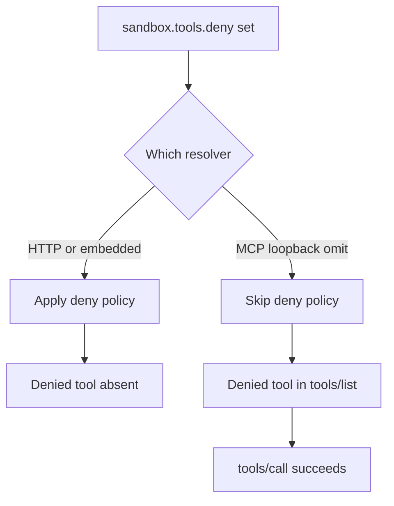

A deny list that one tool surface honours and another skips is a configuration story, not a gate.

Sandboxes and gateways advertise tool allow and deny lists as containment. The architectural residual is which resolver path consumes that list. If the HTTP invoke path filters tools and the bundled MCP loopback builds its schema from an unfiltered set, the operator's `tools.deny` entry never becomes a decision on the loopback. Listing and calling still succeed for tools the sandbox was meant to exclude. Operators who trust the deny config as universal are reading a policy that only some surfaces enforce.

On 11 September 2026, OpenClaw published `GHSA-5m4g-88rg-69pj` for the npm `openclaw` package. In versions before `2026.8.1`, the bundled MCP loopback used by sandboxed coding-agent sessions could omit the sandbox tool deny policy. A sandboxed session could list and invoke tools explicitly named in `sandbox.tools.deny`. The advisory scopes the gap to that loopback path and does not rewrite the trusted-operator model for authenticated Gateway operators. The first stable patch is `2026.8.1`. The merged fix in pull request `103074` applies the same sandbox tool-policy layer used by other runtime tool surfaces before exposing tools to a loopback client, so denied tools leave `tools/list` and fail `tools/call`.

The same residual class showed up earlier on a different policy. OpenClaw pull request `71159` (merged 24 April 2026) records that `McpLoopbackToolCache.resolve()` emitted the tool list as the MCP schema without `applyOwnerOnlyToolPolicy`. The HTTP `/tools/invoke` path and the embedded agent runner already applied that filter. A local process holding the non-owner loopback bearer could call owner-only tools such as `cron`, `gateway`, and `nodes` through `127.0.0.1/mcp`. Identity was computed and never acted on for that surface. The residual is not a missing deny entry. It is treating a policy applied on one tool surface as proof it runs on the loopback.

Treat every sandbox or owner-only deny as a containment claim only when each tool surface proves the same filter before list and call. Inventory HTTP, embedded, and MCP loopback resolvers for the same policy function. Assert in tests that a denied tool is absent from loopback `tools/list` and that `tools/call` never reaches `execute`. Otherwise the residual is a green deny config and a loopback that never read it.

## Recommendations

- Apply the same sandbox and owner-only tool policy on every resolver path that builds a tool schema, including bundled MCP loopback.
- Prove in CI that a tool named in `sandbox.tools.deny` is absent from loopback `tools/list` and blocked on `tools/call` before `execute`.
- Do not treat HTTP `/tools/invoke` enforcement as evidence that `127.0.0.1/mcp` enforces the same list.
- Inventory agent gateways for surface-specific skips of deny, allow, or owner-only filters on loopback MCP.
- Until patched, disable MCP loopback for sandboxed coding agents or remove sensitive tools from the gateway inventory.
