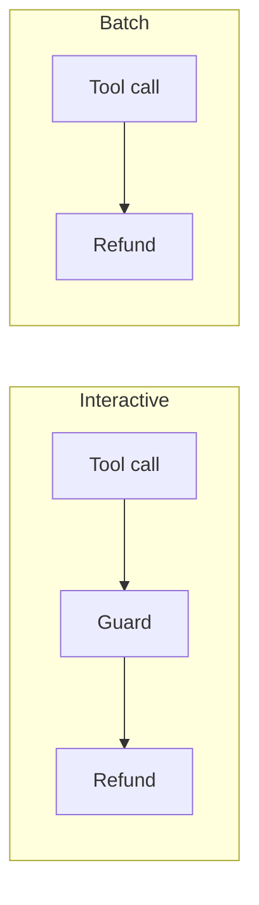
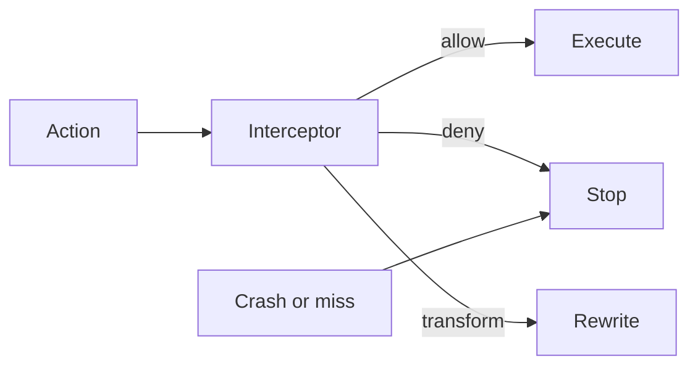

Production agents have tools, credentials, and autonomy. Policies have to be enforced. An approval has to stop the action until a human lifts it. There has to be evidence of what ran. Most framework callbacks were built to watch that loop. Watching is not governance.

A support agent could look up accounts and issue refunds. Refunds over a threshold needed a human to approve them. The approval guard threw an exception on a malformed request. The dispatcher caught it, logged a warning, and issued the refund. The framework documents this as the default: if the guard throws, the refund still runs. A batch entry point never fired the callback at all. Nothing bound either guard to the action that actually ran.

That is the failure class. The control sat on one path. The runtime grew more paths.

LangChain callbacks cannot block. Return values are discarded. Exceptions are swallowed unless the author sets `raise_error`. CrewAI's event bus is observe-only. LlamaIndex instrumentation is telemetry. Semantic Kernel filters can block. When they are registered through dependency injection, execution order is not guaranteed. Order is what decides whether redaction happens before the data leaves.

Agent Hooks is specified as AGENT-HOOKS-0.1. The contract is small. It has eight interception points. An interceptor returns one of three verdicts: allow, deny, or transform. Escalation is a deny that asks a human to lift it. If nobody lifts it, the action stays stopped. A host that cannot reach an interceptor must stop the action itself. So must a host that gets a malformed verdict. The spec calls that synthesizing a deny. A crash is treated as a stop. That is fail-closed: if the guard dies, the action does not run.

An approval is bound to a hash of what the human saw. The bytes hashed are the canonical JSON of the action. The hash is SHA-256. Call that the content identity. It names the action, not the session. Change the refund and the hash changes. Replay the approval against a mutated $8,400 refund. It fails. The content is different. The deny stands.

This is a cooperative contract, not a sandbox. A hostile host can skip points. A direct tool path may never hit `pre_tool_call`. Containing untrusted code is a sandbox's job. The contract's job is to make deny mean deny. That only covers the paths a cooperating host actually runs.
