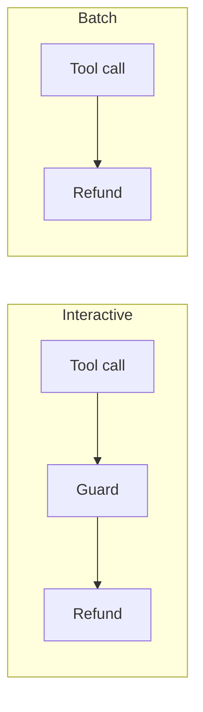
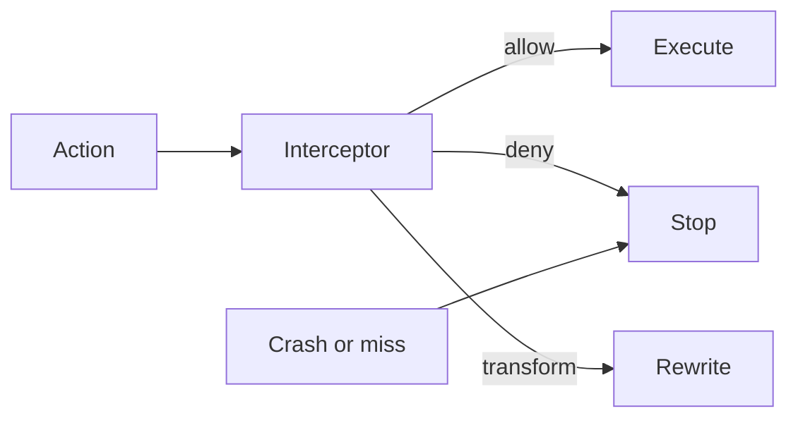

Production agents have tools, credentials, and autonomy, which means policies have to be enforced. An approval has to stop the action until a human lifts it, and there has to be evidence of what ran. Most framework callbacks were built to watch that loop, and watching is not governance.

A support agent could look up accounts and issue refunds, and refunds over a threshold needed a human to approve them. The approval guard threw an exception on a malformed request; the dispatcher caught it, logged a warning, and issued the refund, which the framework documents as the default: if the guard throws, the refund still runs. A batch entry point never fired the callback at all. Nothing bound either guard to the action that actually ran.

That is the failure class. The control sat on one path while the runtime grew more of them.

LangChain callbacks cannot block, because return values are discarded and exceptions are swallowed unless the author sets `raise_error`. CrewAI’s event bus is observe-only, and LlamaIndex instrumentation is telemetry. Semantic Kernel filters can block, but when they are registered through dependency injection, execution order is not guaranteed, and order is what decides whether redaction happens before the data leaves.

Agent Hooks is specified as AGENT-HOOKS-0.1, and the contract is small: eight interception points, with an interceptor returning one of three verdicts (allow, deny, or transform). Escalation is a deny that asks a human to lift it, so if nobody lifts it, the action stays stopped.

A host that cannot reach an interceptor must stop the action itself, and so must a host that gets a malformed verdict; the spec calls that synthesizing a deny. A crash is treated as a stop, which is fail-closed: if the guard dies, the action does not run.

An approval is bound to a hash of what the human saw: the bytes hashed are the canonical JSON of the action, and the hash is SHA-256. Call that the content identity. It names the action, not the session, so changing the refund changes the hash.

Replay the approval against a mutated $8,400 refund and it fails, because the content is different. The deny stands.

This is a cooperative contract, not a sandbox, so a hostile host can skip points and a direct tool path may never hit `pre_tool_call`. Containing untrusted code is a sandbox’s job; the contract’s job is to make deny mean deny, and that only covers the paths a cooperating host actually runs.
