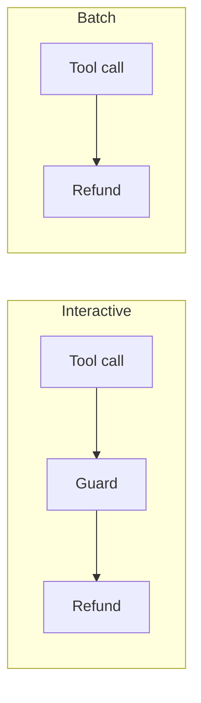
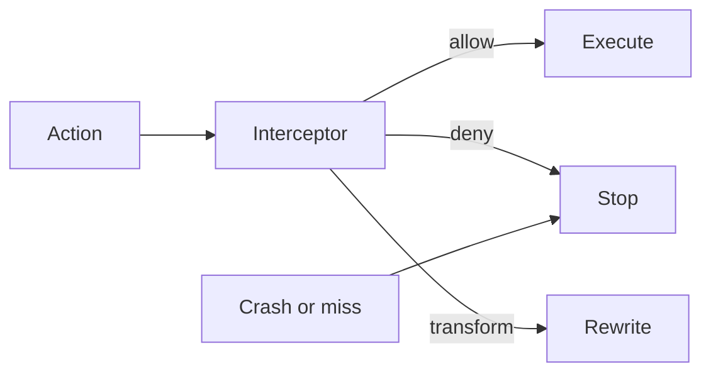

Production agents have tools, credentials, and autonomy. Policies have to be enforced, approvals have to gate the action, and there has to be evidence of what ran. Most framework surfaces were built to observe that loop. Observation is not governance.

A support agent could look up accounts and issue refunds. Refunds over a threshold needed approval. The approval guard threw an exception on a malformed request. The dispatcher caught it, logged a warning, and executed the refund (its documented default). A batch path never fired the callback at all. Nothing bound either guard to what actually ran.

That is the failure class: a control is attached to one path, while the runtime grows new paths.

LangChain callbacks cannot block. Return values are discarded. Exceptions are swallowed unless the author sets `raise_error`. CrewAI's event bus is observe-only. LlamaIndex instrumentation is telemetry. Semantic Kernel filters can block, but dependency-injection order is not guaranteed, and order is what decides whether redaction happens before egress.

Agent Hooks, specified as AGENT-HOOKS-0.1, is a small contract. It has eight interception points and three verdicts: allow, deny, and transform. Escalation is a deny carrying an approval block. An unresolved escalation is still a deny. A host that cannot reach an interceptor, or that receives a malformed verdict, must synthesize a deny.

Approval binds to a SHA-256 of the canonical JSON of exactly what the approver saw. Replaying that approval against a mutated $8,400 refund fails. The content identity changed. The deny stands.

This is a cooperative contract, not a sandbox. A hostile host can skip points. A direct tool path may never hit `pre_tool_call`. Containing untrusted code is a sandbox's job. The contract's job is to make deny mean deny on the paths a cooperating host actually runs.
