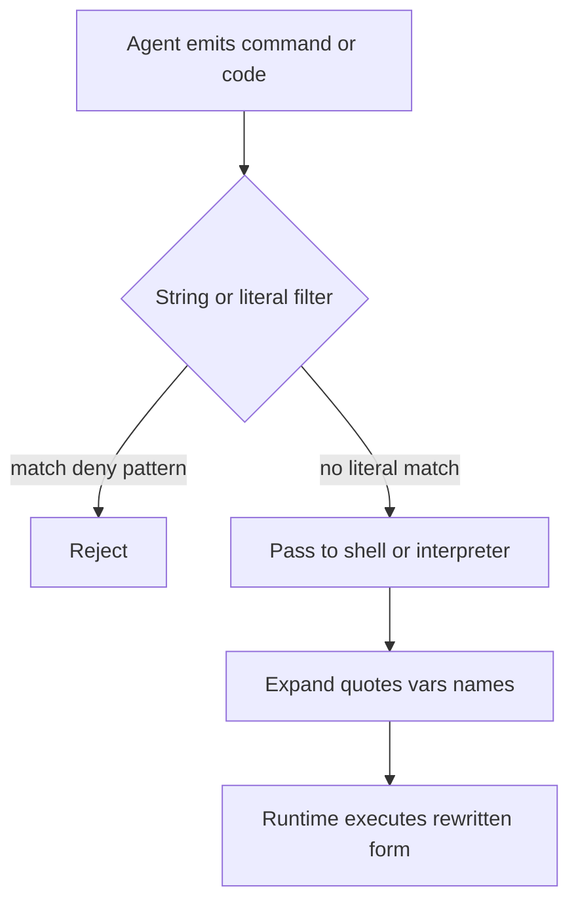

A guard that matches the text it was given is not a proof of what the runtime will run.

Agent shell tools and code sandboxes often gate execution with a string check: a denylist of dangerous fragments, or a scan for forbidden literals in source. The architectural residual is the gap between that inspected form and the form the interpreter or shell actually evaluates. If the check runs before quote removal, expansion, or runtime name construction, a payload can pass inspection and still become a destructive command. A green allow from the filter is then a statement about the bytes presented, not about the process that follows.

On 30 June 2026, Adversa AI published GuardFall. The team surveyed eleven open-source coding and computer-use agents that hand commands to a host shell. Ten left the agent-to-bash boundary exploitable. The common design inspected the raw command string with regex or token patterns, then invoked `bash -c`. Bash later performed quote removal, `$IFS` expansion, command substitution, and pipe composition. Strings such as `r''m`, `rm$IFS-rf$IFS/`, and `echo "$(rm /x)"` survived the matcher and reduced to destructive argv after expansion. Only Continue evaluated commands the way bash would before the allow-or-deny decision. The filters were enabled. The shell still ran a different programme.

The same residual class appears when the inspector looks for literal substrings in source that the runtime never needs to write. IBM `mcp-context-forge` before `1.0.2` (`GHSA-xm98-3vcf-fph7` / `CVE-2026-53710`) shipped a RestrictedPython `python_sandbox_server`. Its `validate_code` path checked for dangerous dunder strings as literals. Raw `getattr` remained in `safe_builtins`. A payload could build those names at runtime, walk the class hierarchy through the exposed `getattr`, reach `subprocess.Popen`, and execute OS commands as the server process. The advisory PoC recorded `validation={'valid': True}` and then a successful marker command. The HTTP/SSE transport could expose `execute_code` with no authentication. The validator passed. The sandbox did not hold.

Treat every command denylist and source substring scan as a containment claim only when the check evaluates the same shape the runtime will execute. Prefer tokenize-and-canonicalize evaluators for shell tools, and policy-controlled attribute access instead of raw `getattr` plus literal dunder filters for sandboxes. Prove in tests that quote-split, `$IFS`, substitution, and runtime-constructed names fail closed. Otherwise the residual is a green filter result and a process that ran text the guard never saw.

## Recommendations

- Evaluate shell commands after tokenization and expansion, not against the raw emitted string.
- Remove raw `getattr` and `setattr` from sandbox builtins; mediate attribute access through an explicit policy helper.
- Replace literal dunder substring scans with a RestrictedPython policy pipeline that cannot be satisfied by runtime name construction.
- Prove in CI that quote-split binaries, `$IFS` splits, command substitution, and constructed dunder paths are denied before execution.
- Do not treat a green denylist or `valid: true` validation result as evidence that the intended programme ran.
