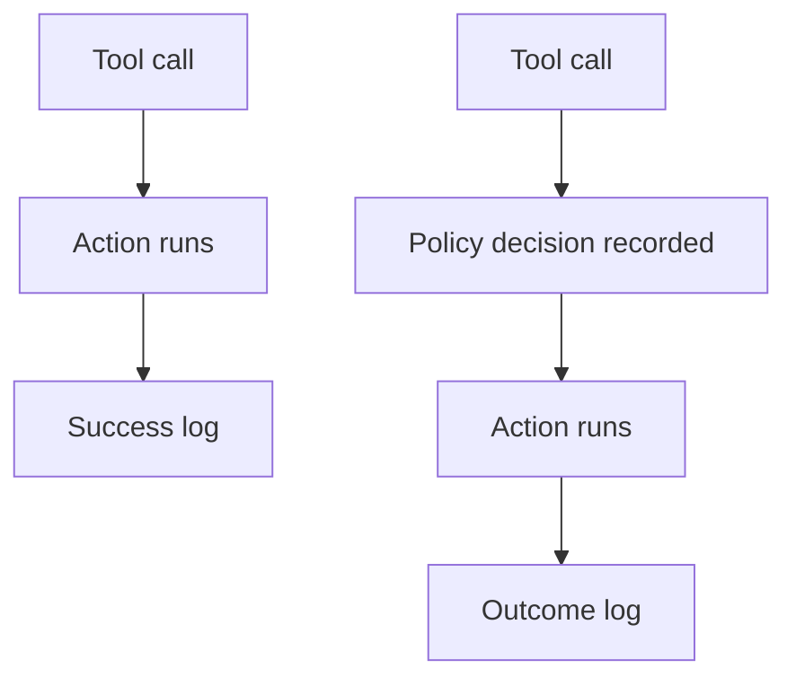

The dashboard said success. Nobody can prove a gate ran.

Token counts, latency charts, and HTTP 200s look like visibility. They are not an audit of the decision. An agent under attack often authenticates correctly, calls an allowed tool, and returns a fluent answer. Every conventional layer reports success because, by its own definition, success is what happened. The failure sits one level up, in the choice to make that call, and default observability rarely records the choice.

The IETF Agent Audit Trail draft (-01, 19 August 2026) names the evidentiary gap. A post-execution log can look complete while providing no evidence that a policy check ran before the action. Denials and escalations that are only written after the fact do not prove enforcement. Self-recording is weaker still: when the agent writes its own trail, it can omit or alter what responders later trust.

Kotrov’s August 2026 guide shows how that looks in an incident. In the Supabase MCP theft through Cursor at General Analysis, the database, MCP server, and model provider each logged a permitted success. A SIEM ingesting those streams sees a developer doing development. The attack lives in the sequence and in the provenance of the instruction, which none of those success lines carry.

A green log that cannot prove a pre-execution decision is a comforting fiction.

## Recommendations

- Record policy decisions before state-changing tool calls, not only after success.
- Prefer an independent recorder over agent self-logging for consequential actions.
- Emit a tool-call decision record with acting principal, resource, and untrusted-input provenance.
- Alert on allowed successes that lack a prior decision record, not only on errors and denials.
- Keep a low-sensitivity decision trail long; put prompt content in a separate, access-logged store.
