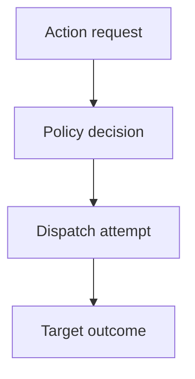

The dashboard said success. Nobody can prove a gate ran.

Token counts, latency charts and HTTP 200s look like visibility. They are not an audit of the decision. An agent under attack can authenticate correctly, call an allowed tool and receive a successful response. Every conventional layer may report success because each is describing a different event.

The distinction is timing and meaning. A record written after a tool returns can describe an outcome. It cannot, by itself, show that an enforceable policy decision existed before dispatch. The current Agent Audit Trail Internet-Draft calls these separate pre-execution and post-execution phases. It is a work in progress, not an IETF standard, but the distinction is useful.

Even a pre-execution record proves only that its recorder emitted a claim. If the agent can alter the recorder, choose the identity fields or rewrite storage, the trail inherits that weakness. Hash chaining can make later edits detectable; it cannot make an untrusted original statement true.

OWASP's logging guidance makes the broader requirement clear: security analysis needs application context such as identity, permissions, target, action and outcome, plus an interaction identifier that links related events. For an agent action, that means correlating the policy decision, the dispatch attempt and the target's result without treating any one source as the whole truth.

A green log is useful evidence. It is not a verdict on the control that produced it.

## Recommendations

- Record the policy decision before every consequential dispatch, including the acting identity, target, action, policy version and reason.
- Correlate decision, dispatch and target records with a server-controlled operation identifier.
- Keep the recorder and log store outside the agent's write authority, then monitor gaps, duplicates and broken ordering.
- Treat transport success, tool acceptance and completed side effect as different outcomes.
- Minimise sensitive content in the trail; protect access tokens, prompts and payloads separately.

Related pattern: [Cross-Boundary Action Evidence](/patterns/cross-boundary-action-evidence/).
