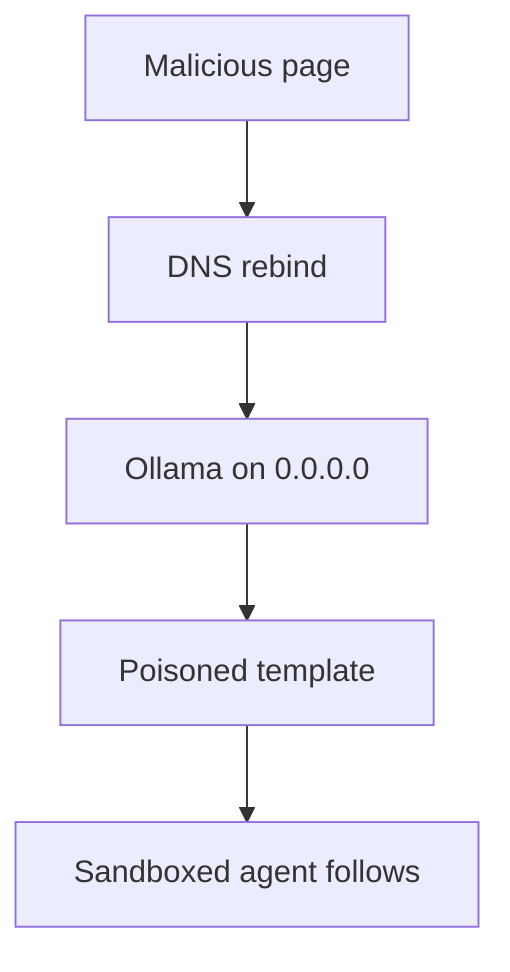

NVIDIA NemoClaw deploys OpenClaw in OpenShell Docker sandboxes. The container cannot reach `127.0.0.1` on the host. So NemoClaw starts Ollama with `OLLAMA_HOST=0.0.0.0:11434`. That bind listens on every interface. It is not loopback.

The installer prints `Using Ollama on localhost:11434`. The socket is not bound to localhost only.

Ollama's API on port 11434 has no authentication. CORS and Host validation are the defenses. Ollama checks the Host header so a webpage cannot pretend to be local. That check is skipped when the bind is not loopback. Binding to `0.0.0.0` drops it.

DNS rebinding fills the gap. An attacker owns a domain. The victim visits a page on that domain. Then the name resolves to `127.0.0.1`. The browser still thinks it is talking to the attacker's site. Origin equals Host, so CORS passes. The page now has unauthenticated access to the local model server.

The useful payload is not a one-shot prompt. `/api/create` accepts a `template` field. That field is a Go template. It is applied at inference to every message. That includes the system prompt the client sends. Injecting a system-prompt field is not enough. OpenClaw sends its own system prompt and would overwrite that. Template injection survives it.

The poison persists across conversations. It does not show in the model name, size, or metadata. Every consumer of that model is affected.

OpenShell still limits the host filesystem, network, and process. The blast radius is not that wall. It is the agent's authorized tools. It is the organization's resources those tools can already reach.

`0.0.0.0` also exposes the API on the LAN. No rebinding is required there.

CVE-2026-65105 is the identifier. Oasis Security found it in NemoClaw. Cyera published on 25 August 2026. Do not treat loopback as a property of the log line. Treat it as a property of the bind.
